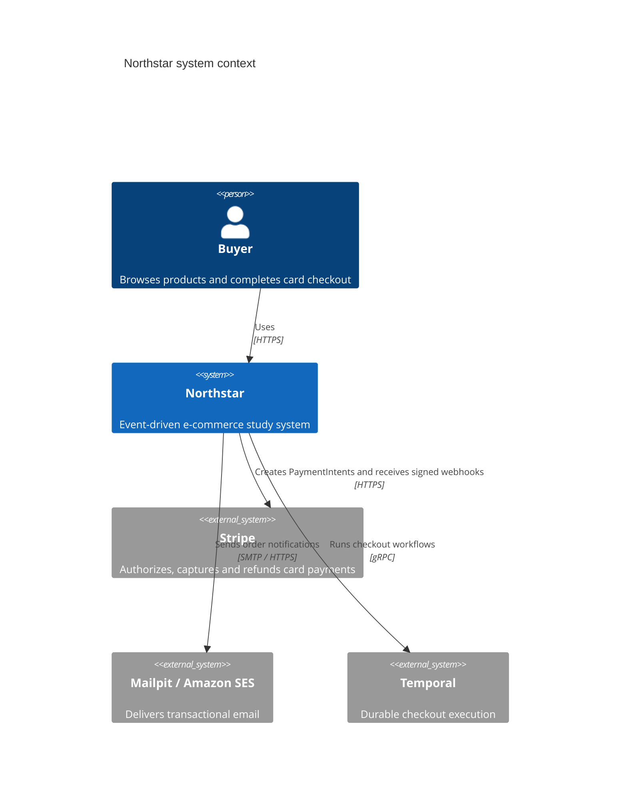
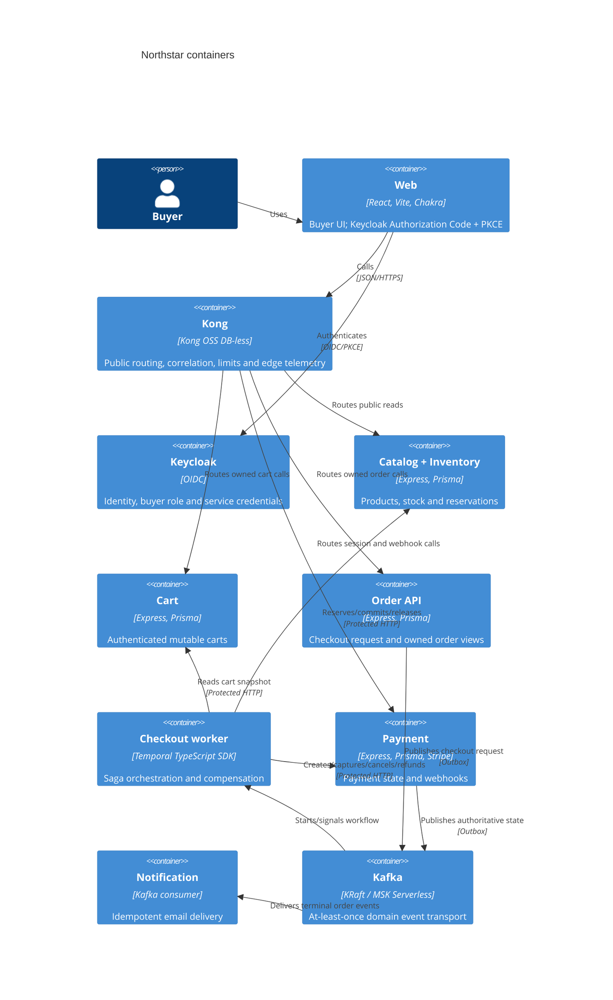
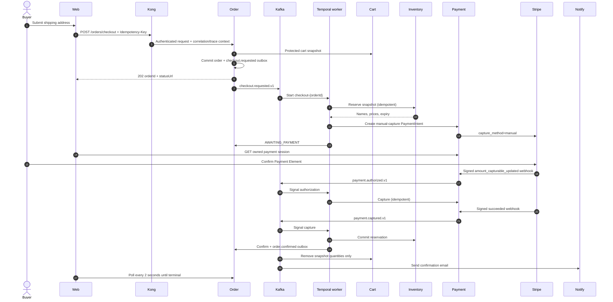

# Architecture

## Context

## Containers

Every domain service has its own PostgreSQL instance, Prisma schema, migrations, connection credentials, outbox where it produces events, and inbox where it consumes them. Keycloak has a sixth PostgreSQL instance. Cross-database queries are forbidden.

## Checkout sequence

Signals may arrive before the workflow starts waiting; Temporal retains them in workflow history. Workflow code performs no I/O, time reads, randomness, or non-deterministic library calls. Activities own all I/O and have bounded exponential retries plus idempotency keys.

## Failure model

Before capture, compensation cancels any PaymentIntent and releases stock. After capture, it refunds first and then releases stock. A failure of either exhausted compensation moves the order to `MANUAL_REVIEW` and retains identifiers for an operator. Business failures are non-retryable; transient network/provider failures are retryable. Kafka consumers deduplicate by `eventId`, and webhook receipts deduplicate by Stripe event ID.
