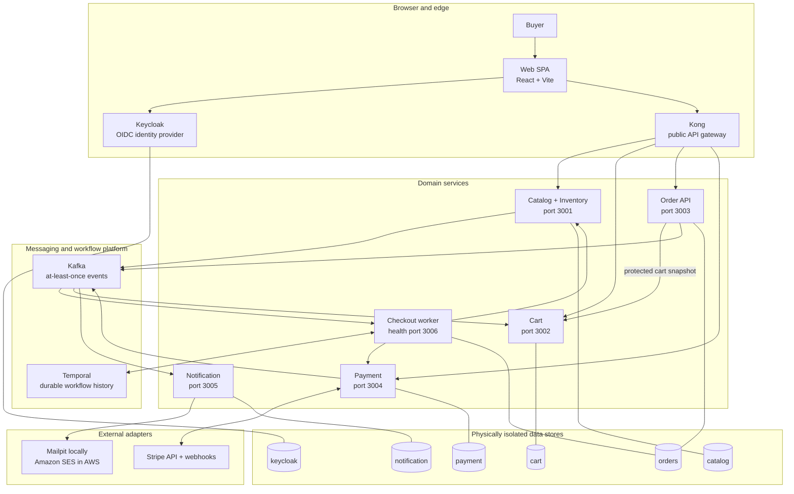
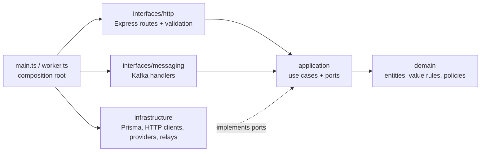
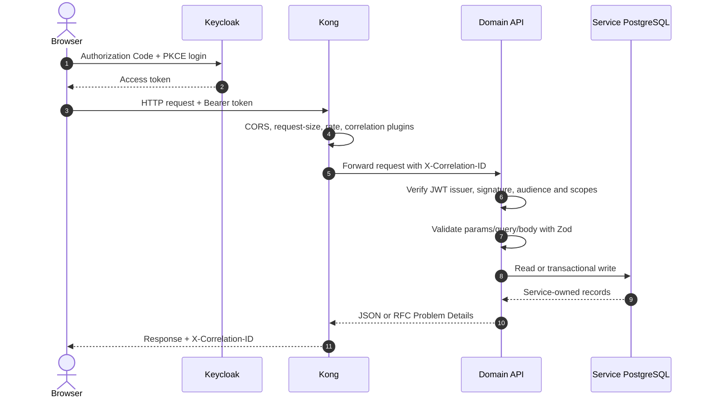

# Architecture

## 1. System purpose and boundaries

Northstar is deliberately small in business scope but realistic in distributed-systems shape. The buyer-facing capabilities are:

- browse a seeded catalog and see currently available inventory;
- authenticate or register through Keycloak;
- add, update, and remove cart items;
- submit a Brazilian delivery address;
- start an idempotent asynchronous checkout;
- authorize a card payment through Stripe Elements;
- follow a durable order state until confirmation, failure, or manual review;
- receive a confirmation or failure email; and
- view owned order history.

The system does not currently calculate shipping or taxes, manage fulfillment, expose an admin application, support guest carts, or process multiple currencies. These exclusions keep the distributed flow understandable and prevent additional bounded contexts from obscuring the main study topics.

## 2. Runtime architecture



The order API and checkout worker share the **order bounded context** and the same order database, but they are separate processes. This lets the synchronous API scale and fail independently from long-running workflow execution.

## 3. Architectural styles used together

### Microservices and bounded contexts

There are five domain services:

| Bounded context     | Owns                                                                  | Does not own                                 |
| ------------------- | --------------------------------------------------------------------- | -------------------------------------------- |
| Catalog + Inventory | product content, prices, on-hand quantity, reservations               | carts, orders, payments                      |
| Cart                | one mutable cart per identity and cart version                        | product details or authoritative prices      |
| Order               | checkout requests, immutable snapshots, customer-facing state         | inventory balances or provider payment state |
| Payment             | provider identifiers, client secrets, webhook receipts, payment state | orders or inventory                          |
| Notification        | rendered email and delivery attempts                                  | order state or user identity                 |

Keycloak owns users and credentials, so there is intentionally no user service. Product and inventory remain together because the current system has one sales channel and no separate inventory-planning lifecycle.

### Clean Architecture inside services

Each service follows the same inward-dependency shape even when a small service does not need every folder:



Important consequences:

- Domain and application code do not import Prisma models.
- Repository and provider interfaces are declared as application ports.
- Infrastructure adapters implement those ports and map database records into service-owned domain types.
- `main.ts` is the composition root: it loads configuration, starts telemetry, constructs adapters, connects infrastructure, starts HTTP/Kafka/Temporal processing, and installs graceful shutdown handlers.
- Shared workspace packages contain technical capabilities only; they do not share business entities.

### Event-driven architecture

Kafka decouples producers from asynchronous reactions. The order service does not call notification or cart cleanup directly. It publishes a self-contained terminal event, and each consumer reacts independently. Events use a versioned envelope and are partitioned by aggregate/order ID to preserve useful per-order ordering.

Delivery is intentionally **at least once**, so deduplication is implemented in service databases rather than assumed from Kafka.

### Orchestration Saga

Checkout is a multi-service transaction that cannot use a database transaction across service boundaries. Temporal runs an orchestration Saga:

1. reserve inventory;
2. snapshot canonical product details and prices into the order;
3. create a manual-capture payment;
4. wait durably for authorization;
5. request capture;
6. wait durably for capture confirmation;
7. commit inventory; and
8. confirm the order.

If a later step fails, the workflow cancels or refunds payment and releases inventory in reverse-risk order. A failed compensation produces `MANUAL_REVIEW` instead of pretending the distributed state is consistent.

## 4. Communication model

| From                  | To                | Mechanism                               | Why this mechanism is used                                               |
| --------------------- | ----------------- | --------------------------------------- | ------------------------------------------------------------------------ |
| Browser               | Keycloak          | OIDC Authorization Code + PKCE          | secure public-client login without storing a client secret in the SPA    |
| Browser               | Kong              | HTTP/JSON                               | request/response UI operations and a single public backend origin        |
| Kong                  | domain APIs       | HTTP/JSON                               | routing plus edge controls; services still authorize requests themselves |
| Order API             | Cart              | protected HTTP                          | checkout needs the cart snapshot before accepting the order              |
| Checkout worker       | Catalog/Inventory | protected HTTP commands                 | the workflow needs an immediate reservation/commit/release result        |
| Checkout worker       | Payment           | protected HTTP commands                 | the workflow needs immediate create/capture/cancel/refund results        |
| Order/Payment/Catalog | Kafka             | transactional outbox relay              | publish state facts without a database/Kafka dual-write gap              |
| Kafka                 | Worker            | event handler + Temporal client         | starts workflows and delivers payment signals                            |
| Kafka                 | Cart/Notification | consumer groups                         | asynchronous independent reactions                                       |
| Worker                | Temporal          | gRPC                                    | durable timers, retries, signals, and workflow history                   |
| Payment               | Stripe            | HTTPS SDK calls and signed webhook HTTP | provider-controlled authorization/capture state                          |
| Notification          | Mailpit/SES       | SMTP or AWS API                         | adapter selected by environment                                          |

Internal endpoints are not present in Kong's route table. They are protected with client-credentials tokens containing explicit audience and scope claims unless the isolated E2E configuration sets `AUTH_DISABLED=true`.

## 5. Typical public request lifecycle



Kong is not treated as the only security boundary. Each protected API verifies the token again and checks resource ownership, such as `order.userId === token.sub` or `payment.userId === token.sub`.

## 6. Repository organization

```text
apps/web/                         React buyer storefront
services/catalog-inventory/       Catalog and stock bounded context
services/cart/                    Cart bounded context
services/order/                   Order API, Temporal workflow, and worker
services/payment/                 Payment bounded context and Stripe adapter
services/notification/            Terminal order email consumer
packages/auth/                    JWT and service-token helpers
packages/config/                  Runtime environment validation
packages/contracts/               Zod HTTP/event contracts and generators
packages/http/                    Express request/error/health utilities
packages/logger/                  Structured Pino logger
packages/messaging/               Kafka event bus, retry, DLQ, event creation
packages/observability/           OpenTelemetry SDK and business metrics
packages/test-utils/               Testcontainers and Stripe fixture helpers
infra/                            Local platform configuration and Terraform
tests/                            Cross-workspace integration and E2E tests
docs/                             Architecture, decisions, operations, and guides
```

The repository is a pnpm workspace coordinated by Turborepo. Workspace dependencies use `workspace:*`, so services consume the local shared packages rather than independently published packages.

## 7. Design rules that keep the system understandable

- **Physical data ownership:** every domain service and Keycloak has a separate PostgreSQL instance locally and a separate RDS instance in the AWS reference design.
- **No shared business models:** HTTP/event contracts are shared, but service domain types and Prisma clients are private.
- **Commands versus facts:** synchronous HTTP commands return immediate business results; Kafka events describe completed state changes.
- **Idempotency at boundaries:** checkout keys, deterministic order/workflow IDs, provider keys, inbox rows, webhook receipts, and unique database constraints all address different duplicate sources.
- **Canonical snapshotting:** cart keeps only product IDs and quantities; inventory supplies names and prices during reservation; order stores that result so later product edits do not rewrite history.
- **Failure is represented:** compensating, failed, and manual-review states are explicit business states.
- **Observability starts before composition:** OpenTelemetry is initialized before application modules are dynamically imported, allowing auto-instrumentation to patch libraries early.
- **Generated contracts are checked:** Zod registries generate OpenAPI/AsyncAPI, Prisma schemas generate clients, and CI fails if committed generated output drifts.

## 8. Architectural trade-offs

The architecture favors teaching clarity and realistic failure behavior over minimal local resource use. Five application databases, a Keycloak database, Kafka, Temporal, and the observability stack are heavy for a small storefront. Conversely, several production-hardening concerns remain intentionally unfinished: the AWS stack has not been applied, inventory expiry has no sweeper, Temporal replay/time-skipping coverage is incomplete, and local observability does not equal a managed production telemetry design. The exact current limitations are listed in [Development, testing, and reference](08-development-testing-and-reference.md#current-limitations-and-important-nuances).
