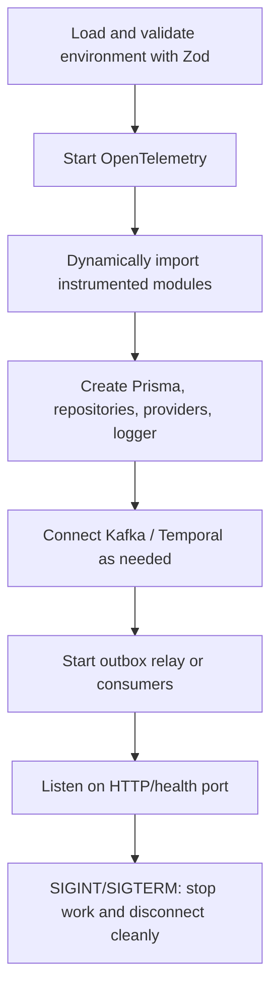
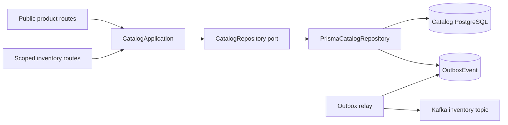
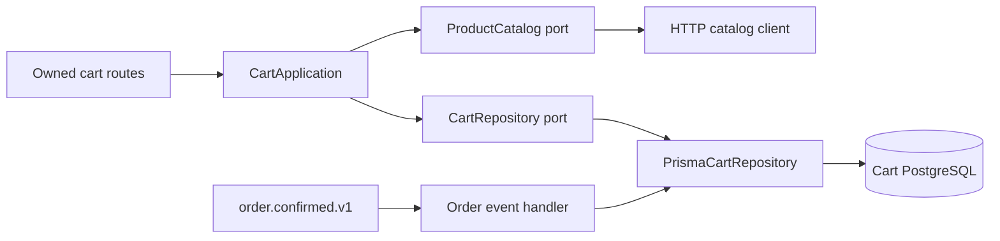
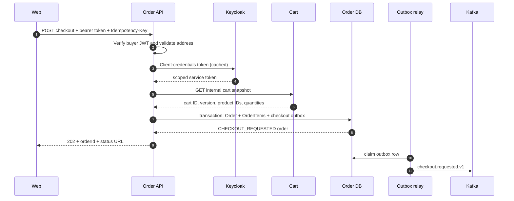
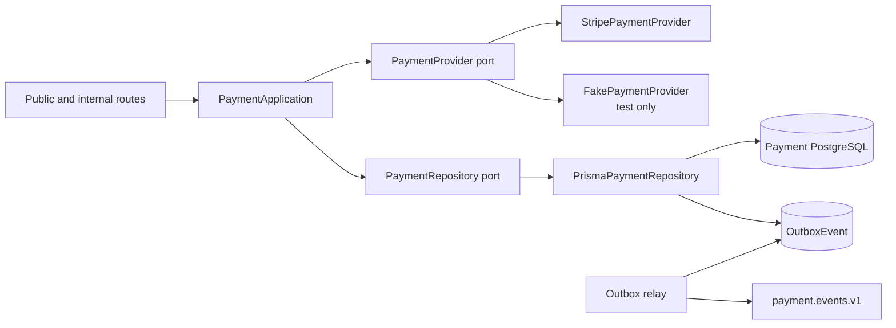
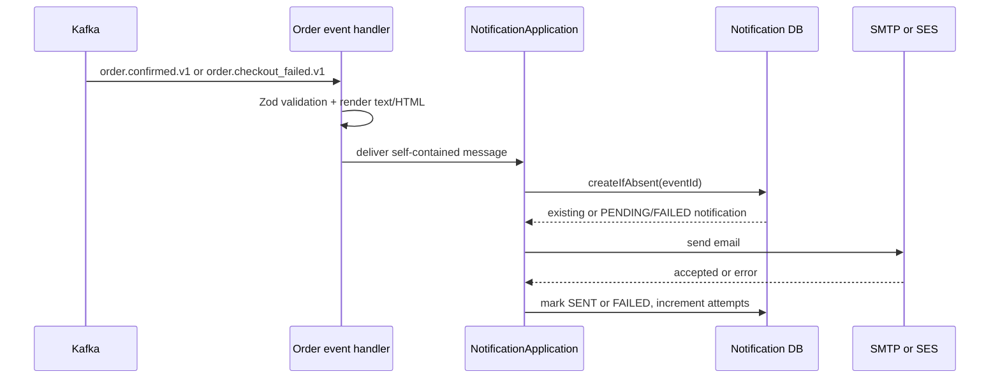
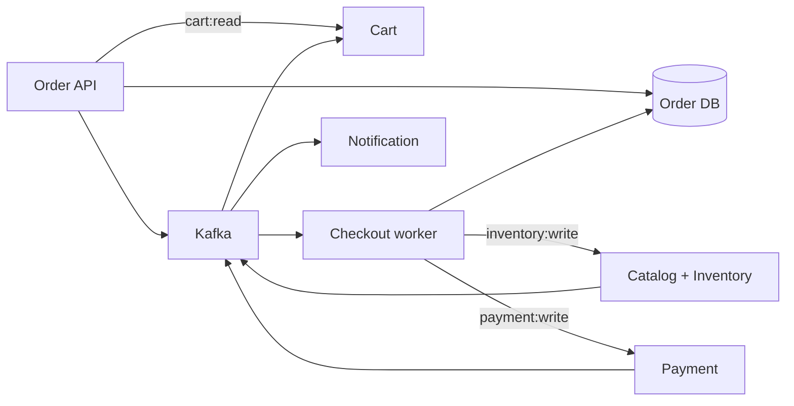

# Services

## 1. Common service structure and startup behavior

The five domain services are strict TypeScript Node.js applications. Catalog, cart, order, and payment expose public or internal Express routes. Notification exposes only liveness/readiness and otherwise works as a Kafka consumer. The order bounded context also supplies a separately deployed Temporal worker.

A normal service startup follows this order:

All APIs disable Express's `x-powered-by` header, install correlation context, limit JSON body size, expose `/health/live` and `/health/ready`, and return RFC Problem Details through the shared error handler. Configuration fails fast at process startup if required environment values are missing or invalid.

## 2. Catalog and inventory service

Location: [`services/catalog-inventory`](../../services/catalog-inventory/)

### Responsibility

This service combines product catalog and inventory because the current scope has one storefront and one stock pool. It is the authoritative source for:

- product SKU, name, description, image, active flag, and price;
- physical on-hand and reserved quantities;
- available quantity, computed as `max(0, onHand - reserved)`;
- one inventory reservation per order;
- canonical product names and unit prices captured during reservation; and
- inventory reservation lifecycle events.

It does not own cart quantities, order status, or payment state.

### Internal architecture

`CatalogApplication` keeps use-case rules small: a missing product becomes `PRODUCT_NOT_FOUND`, and an empty reservation becomes `EMPTY_RESERVATION`. The Prisma repository owns concurrency-sensitive stock changes, persistence mapping, idempotency, and outbox writes.

### HTTP surface

| Method and path                                             | Exposure      | Authentication                                                | Behavior                                                              |
| ----------------------------------------------------------- | ------------- | ------------------------------------------------------------- | --------------------------------------------------------------------- |
| `GET /api/v1/products`                                      | Kong/public   | none                                                          | cursor pagination of active products, default 20 and maximum 50       |
| `GET /api/v1/products/:productId`                           | Kong/public   | none                                                          | active product with computed available quantity                       |
| `POST /internal/v1/inventory/reservations/:orderId`         | internal only | audience `catalog-inventory-service`, scope `inventory:write` | atomically reserve requested quantities and return canonical snapshot |
| `POST /internal/v1/inventory/reservations/:orderId/commit`  | internal only | same                                                          | decrement both `reserved` and `onHand`                                |
| `POST /internal/v1/inventory/reservations/:orderId/release` | internal only | same                                                          | decrement `reserved` but keep `onHand`                                |

### Reservation transaction

For each requested item, a conditional PostgreSQL `UPDATE ... FROM ... RETURNING` increments `reserved` only when the product is active and enough unreserved stock exists. All item updates, the reservation row, reservation items, and `inventory.reserved.v1` outbox event occur inside one Prisma transaction. If any item lacks stock, PostgreSQL rolls the entire transaction back, preventing partial reservations.

The unique `InventoryReservation.orderId` makes reserve idempotent. Repeating a reserve request returns the existing reservation. Commit and release return the already-reached state when repeated, but reject a conflicting transition from any state other than `ACTIVE`.

### Data model

| Model                  | Purpose                                                                 |
| ---------------------- | ----------------------------------------------------------------------- |
| `Product`              | catalog content, integer centavo price, active flag                     |
| `InventoryItem`        | one stock balance per product; database check prevents invalid balances |
| `InventoryReservation` | one reservation per order, status and `expiresAt`                       |
| `ReservationItem`      | reserved product/quantity join                                          |
| `OutboxEvent`          | durable inventory event awaiting or recording Kafka publication         |

The catalog seed upserts six deterministic products and creates initial inventory. Product IDs are stable UUID-like values so browser and E2E behavior is reproducible.

### Events and configuration

The service produces `inventory.reserved.v1`, `inventory.committed.v1`, and `inventory.released.v1` on `catalog-inventory.events.v1`. No current application consumer reacts to these events; they provide an integration/audit surface.

Important configuration includes `PORT` (3001), `DATABASE_URL`, `INTERNAL_AUTH_AUDIENCE`, `RESERVATION_TTL_MS` (15 minutes), and `OUTBOX_INTERVAL_MS` (1 second). `expiresAt` is persisted and returned, but the current implementation has no expiry sweeper that moves old active reservations to `EXPIRED` or automatically releases them.

## 3. Cart service

Location: [`services/cart`](../../services/cart/)

### Responsibility

The cart service owns one mutable cart per Keycloak subject, its item quantities, and a monotonically increasing version. A cart stores only product IDs and quantities; it deliberately does not duplicate product names or prices.

### Internal architecture

`CartApplication.add` checks the domain quantity invariant and synchronously verifies that the product exists through the catalog public endpoint. Updating an existing cart item does not re-query the catalog. The repository creates a cart lazily on first read through an upsert.

### HTTP surface

| Method and path                        | Exposure      | Authentication                             | Behavior                                      |
| -------------------------------------- | ------------- | ------------------------------------------ | --------------------------------------------- |
| `GET /api/v1/cart`                     | Kong/public   | buyer token, audience `web-app`            | get or lazily create the caller's cart        |
| `POST /api/v1/cart/items`              | Kong/public   | buyer token                                | add quantity to an existing item or create it |
| `PATCH /api/v1/cart/items/:productId`  | Kong/public   | buyer token                                | replace an item quantity                      |
| `DELETE /api/v1/cart/items/:productId` | Kong/public   | buyer token                                | remove an item if present                     |
| `GET /internal/v1/carts/:userId`       | internal only | audience `cart-service`, scope `cart:read` | return the snapshot used to start checkout    |

All owned routes derive `userId` from the verified JWT subject rather than accepting it from the browser. The internal snapshot endpoint is called by the order API using a Keycloak client-credentials token.

### Persistence and confirmed-order cleanup

`Cart` has a unique `userId`, a version, and `CartItem` children keyed by `(cartId, productId)`. Add/update/remove operations mutate the item and increment the version in one database transaction.

The service consumes `order.confirmed.v1` using consumer group `cart-order-events-v1`. It removes only the quantities contained in the checked-out order snapshot. If the buyer added more of the same product after checkout started, the later quantity remains. The effect and `InboxEvent` insertion happen in one transaction, so duplicate Kafka delivery cannot repeat the subtraction.

Important configuration includes `PORT` (3002), `CATALOG_BASE_URL`, `USER_AUTH_AUDIENCE`, `INTERNAL_AUTH_AUDIENCE`, and common database/Kafka/identity settings.

## 4. Order API

Location: [`services/order`](../../services/order/)

### Responsibility

The order API is the synchronous entry to checkout and the source of buyer-visible order state. It owns:

- checkout idempotency per buyer;
- the cart ID and cart version captured at checkout start;
- the shipping-address snapshot and recipient email;
- order items, later enriched with canonical names and unit prices;
- reservation and payment references;
- total amount and status;
- failure/manual-review reason;
- terminal order events; and
- order-context inbox/outbox records.

### Checkout acceptance flow

The order is accepted before distributed checkout completes. The browser follows the returned resource instead of holding a long request open.

### HTTP surface

| Method and path                | Authentication               | Behavior                                                                             |
| ------------------------------ | ---------------------------- | ------------------------------------------------------------------------------------ |
| `POST /api/v1/orders/checkout` | buyer token with email claim | require an `Idempotency-Key`, read the caller's cart, persist checkout, return `202` |
| `GET /api/v1/orders`           | buyer token                  | cursor-paginated orders filtered by token subject                                    |
| `GET /api/v1/orders/:orderId`  | buyer token                  | return only an order owned by the token subject                                      |

The checkout body contains only the shipping address. Product IDs and quantities come from the protected cart snapshot, and recipient email comes from the verified identity token. This prevents a browser from creating an order for another user or silently replacing server-known cart data.

### Idempotency and snapshot enrichment

`(userId, idempotencyKey)` is unique. A repeated checkout with the same key returns the existing order. The new order initially contains product IDs and quantities; after inventory reservation, `applyReservation` fills in canonical names and unit prices, sets `reservationId`, calculates the integer total, and moves the order to `INVENTORY_RESERVED`.

The order API and worker both use `PrismaOrderRepository`. Terminal transitions update the order and insert either `order.confirmed.v1` or `order.checkout_failed.v1` in the same transaction. These events include all data required by cart and notification consumers, avoiding synchronous callbacks into order.

### Data model and events

| Model         | Purpose                                                                   |
| ------------- | ------------------------------------------------------------------------- |
| `Order`       | identity ownership, idempotency, snapshots, distributed references, state |
| `OrderItem`   | product/quantity plus canonical name and unit price                       |
| `InboxEvent`  | deduplication for events handled by the checkout worker path              |
| `OutboxEvent` | durable checkout/terminal event publication                               |

The service produces `checkout.requested.v1`, `order.confirmed.v1`, and `order.checkout_failed.v1` on `order.events.v1`.

## 5. Checkout worker and Temporal workflow

Location: [`services/order/src/worker.ts`](../../services/order/src/worker.ts) and [`services/order/src/temporal`](../../services/order/src/temporal/)

### Why it is a separate process

The worker belongs to the order bounded context but has a different operational job from the HTTP API. It maintains Kafka consumers, Temporal client/worker connections, workflow task execution, and durable activities. Separating it lets HTTP traffic and workflow load scale independently and prevents an API restart from being the owner of a long-running timer.

### Components

| Component             | Role                                                                                 |
| --------------------- | ------------------------------------------------------------------------------------ |
| `worker.ts`           | composition root; connects Temporal, Kafka, Prisma, activities, and health server    |
| `checkout-handler.ts` | validates Kafka events, starts workflows, and signals payment state                  |
| `workflows.ts`        | deterministic Saga state machine; contains no direct I/O                             |
| `activities.ts`       | all database and HTTP I/O, token acquisition, error classification, idempotency keys |
| `types.ts`            | workflow input and activity contract                                                 |

The Kafka consumer group is `checkout-worker-v1`, subscribed to order and payment topics. `checkout.requested.v1` starts workflow ID `checkout-{orderId}` on task queue `checkout-v1`. Starting an already-existing workflow is treated as idempotent. Payment authorized/captured/failed events signal the same workflow.

Workflow signals can arrive before the code begins waiting; Temporal records them in workflow history. Activities use a 20-second start-to-close timeout and retry up to five times with exponential backoff. HTTP 4xx responses other than 408/429 are classified as non-retryable Temporal application failures; transient and server failures remain retryable.

The worker exposes a small native HTTP health server on port 3006. Its current readiness response confirms that the worker process reached startup; it does not perform a fresh dependency probe on every health request.

See [Data, events, and checkout workflow](05-data-events-and-workflows.md) for the complete success and compensation sequences.

## 6. Payment service

Location: [`services/payment`](../../services/payment/)

### Responsibility

The payment service isolates provider-specific payment state and sensitive provider references. It owns:

- one payment per order;
- the mapping from internal payment ID to Stripe PaymentIntent ID;
- the Stripe client secret returned only to the owning buyer;
- manual-capture state, failure code, cancellation, and refund state;
- deduplication of Stripe webhook event IDs; and
- payment authorization/capture/failure outbox events.

### Provider abstraction

The Stripe provider creates card-only PaymentIntents with `capture_method: manual`. This separates authorization from capture so the workflow can confirm that inventory is reserved before taking funds. Stripe SDK idempotency keys come from the order workflow.

The fake provider exists only for deterministic E2E tests. Configuration throws if `PAYMENT_PROVIDER=fake` outside `NODE_ENV=test`, and the fake authorization route is registered only under those same conditions.

### HTTP surface

| Method and path                                   | Exposure/authentication                                     | Behavior                                                                               |
| ------------------------------------------------- | ----------------------------------------------------------- | -------------------------------------------------------------------------------------- |
| `GET /api/v1/payments/:paymentId/session`         | Kong, buyer token                                           | return provider/client secret only when the payment belongs to the token subject       |
| `POST /api/v1/payments/webhooks/stripe`           | Kong, Stripe signature                                      | verify raw body and signature, deduplicate provider event, update state, enqueue event |
| `POST /api/v1/payments/:paymentId/fake/authorize` | Kong only in E2E mode, buyer token                          | deterministically authorize fake payment                                               |
| `POST /internal/v1/payments`                      | internal, audience `payment-service`, scope `payment:write` | create or return the order's payment                                                   |
| `POST /internal/v1/payments/:paymentId/capture`   | same                                                        | capture authorized payment                                                             |
| `POST /internal/v1/payments/:paymentId/cancel`    | same                                                        | cancel provider payment                                                                |
| `POST /internal/v1/payments/:paymentId/refund`    | same                                                        | refund a captured payment                                                              |

The webhook route is mounted before `express.json()`, using `express.raw()` so Stripe verifies the exact unmodified bytes. `Stripe-Signature` is mandatory. `WebhookReceipt.providerEventId` makes repeat delivery idempotent.

For real Stripe capture, the synchronous capture response does not become authoritative order input. The service waits for Stripe's signed `payment_intent.succeeded` webhook, writes `payment.captured.v1`, and the worker receives that fact through Kafka. The fake adapter emits captured state directly because there is no external webhook source.

### Data and events

| Model            | Purpose                                                        |
| ---------------- | -------------------------------------------------------------- |
| `Payment`        | internal/provider mapping, owner, amount, client secret, state |
| `WebhookReceipt` | unique Stripe event ID and processed type                      |
| `OutboxEvent`    | durable payment event publication                              |

The implementation emits `payment.authorized.v1`, `payment.captured.v1`, and `payment.failed.v1`. The shared contract also declares `payment.refunded.v1`, but the current refund path does not emit it.

## 7. Notification service

Location: [`services/notification`](../../services/notification/)

### Responsibility and flow

Notification has no public business API. It consumes terminal order events, renders English email, persists the delivery attempt, and sends through the environment-selected provider.

`order.confirmed.v1` and `order.checkout_failed.v1` include recipient email, display ID, items, total, and failure reason, so notification never needs a synchronous order lookup. HTML interpolation escapes untrusted values.

`SmtpEmailProvider` uses Nodemailer and Mailpit locally. `SesEmailProvider` uses AWS SDK SES v2 and the ECS task role in AWS. `Notification.eventId` is unique, so an already `SENT` event is skipped. A failed notification can be retried by Kafka handling and will attempt delivery again.

There is an unavoidable external-side-effect nuance: if the email provider accepts a message and the process crashes before `markSent`, Kafka redelivery may send a duplicate email. The database prevents ordinary duplicate handling but cannot atomically commit with SMTP/SES.

The service uses consumer group `notification-order-events-v1`, exposes only `/health/live` and `/health/ready`, and emits no domain events in the current version.

## 8. Service-to-service dependency summary

There are no direct calls from cart to order, payment to order, notification to order, or catalog to order. Those directions use events, which keeps terminal reactions independent and avoids circular synchronous service dependencies.
