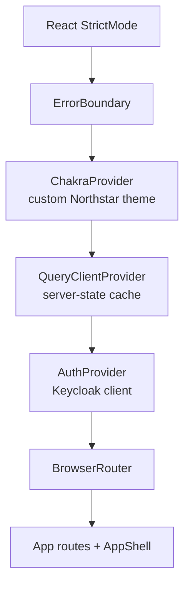
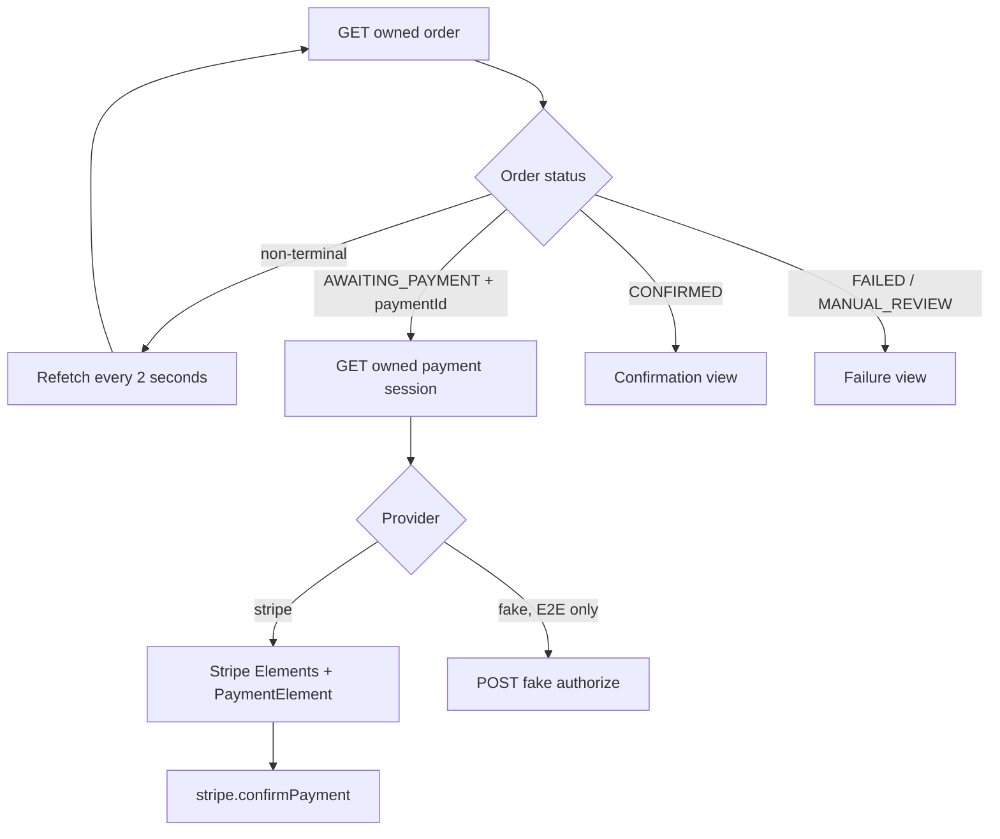
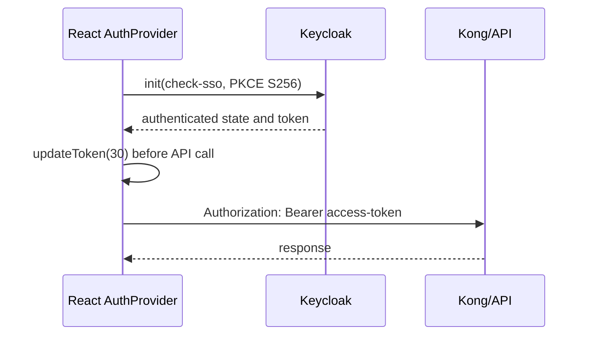

# Web application

Location: [`apps/web`](../../apps/web/)

## 1. Purpose

The web application is a buyer-facing single-page application built with React and Vite. It renders the catalog, product details, owned cart, delivery-address form, order history, durable checkout progress, and Stripe Payment Element. It contains presentation and browser-integration logic, while authoritative pricing, inventory, order, and payment decisions remain in backend services.

## 2. Application composition

[`src/main.tsx`](../../apps/web/src/main.tsx) builds a provider tree around the route application:

- `StrictMode` catches unsafe React behavior in development.
- `ErrorBoundary` catches otherwise unhandled render errors and offers a reload action.
- `ChakraProvider` supplies component primitives and the custom navy/sand/coral tokens.
- `QueryClientProvider` manages remote data with a 15-second stale time and one default retry.
- `AuthProvider` initializes Keycloak, refreshes tokens, and exposes login/logout/register helpers.
- `BrowserRouter` supplies client-side navigation.

The root shell adds skip navigation, header, primary navigation, account actions, an `<Outlet>` for pages, and the footer. CSS media queries adapt the product grid, cart, order list, and navigation for tablet/mobile widths, and reduced-motion preferences disable transitions.

## 3. Routing and pages

[`src/App.tsx`](../../apps/web/src/App.tsx) defines these routes:

| Browser route          | Page           | Protection                        | Backend behavior                                                |
| ---------------------- | -------------- | --------------------------------- | --------------------------------------------------------------- |
| `/`                    | `CatalogPage`  | public                            | list products                                                   |
| `/products/:productId` | `ProductPage`  | public; add action triggers login | get product, optionally add to cart                             |
| `/cart`                | `CartPage`     | `Protected`                       | get cart; separately fetch product details; update/remove items |
| `/checkout`            | `CheckoutPage` | `Protected`                       | validate address and start checkout                             |
| `/orders`              | `OrdersPage`   | `Protected`                       | list owned orders                                               |
| `/orders/:orderId`     | `OrderPage`    | `Protected`                       | poll owned order; render payment when ready                     |
| anything else          | redirect       | none                              | navigate to `/`                                                 |

`Protected` immediately calls `auth.login()` when a route requires identity and renders a redirecting state in the meantime.

### Catalog and product pages

`CatalogPage` loads the first product page through TanStack Query and renders reusable `ProductCard` components. Adding from a card or product page uses a mutation, then invalidates the `['cart']` query. If the buyer is anonymous, the same action starts Keycloak login instead of calling the cart API.

`ProductPage` uses the route parameter as its query key, displays current availability, and disables add-to-cart when quantity is zero. The backend still revalidates product existence and inventory later; the UI state is a convenience, not a security or consistency boundary.

### Cart page

The cart API returns only IDs and quantities. `CartPage` therefore uses `useQueries` to fetch each product's display data and current price. It constructs a `productMap` for rendering and calculates the displayed subtotal in the browser.

This subtotal is not the checkout authority. During the Saga, catalog/inventory returns canonical prices and the order service recomputes the total from the reservation snapshot. A catalog price change between cart display and checkout therefore becomes visible in the final order snapshot rather than trusting the browser.

Quantity changes and removals share one mutation. A present `quantity` calls PATCH; an omitted quantity calls DELETE. On success, the cart cache is invalidated.

### Checkout form

`CheckoutPage` uses React Hook Form with a Zod resolver. Validation covers required address fields, two-letter state normalization, Brazilian postal-code shape, and country `BR`. On submit it:

1. parses and transforms the form value;
2. creates a random UUID idempotency key;
3. sends the address and key to the order API; and
4. navigates to `/orders/{orderId}?checkout=true` after the `202` response.

The current idempotency key is created inside the mutation call. It protects retries of that exact request path, but a user manually resubmitting the form after a client-level failure can generate a new key and therefore a new checkout.

### Order progress and payment

`OrderPage` polls while the order is not terminal. It stops for `CONFIRMED`, `FAILED`, or `MANUAL_REVIEW`. When the order reaches `AWAITING_PAYMENT`, it obtains a payment session from the payment service. Ownership is checked server-side before the provider and client secret are returned.

For Stripe, the application initializes `loadStripe` once from `VITE_STRIPE_PUBLISHABLE_KEY`, wraps the form with `Elements`, renders `PaymentElement`, and calls `stripe.confirmPayment` with `redirect: 'if_required'`. Stripe communicates authoritative state back to the payment service through signed webhooks; the browser does not mark the order paid.

For the test-only fake provider, the UI renders a deterministic authorize button. That backend route is unavailable in normal development/production Stripe mode.

## 4. Authentication implementation

[`src/auth/auth-context.tsx`](../../apps/web/src/auth/auth-context.tsx) wraps `keycloak-js`.

Important details:

- The SPA is a public Keycloak client and uses Authorization Code with PKCE S256.
- `check-sso` restores an existing session without always forcing a login screen.
- `checkLoginIframe` is disabled, avoiding an extra iframe-based session monitor.
- A `useRef` ensures React development Strict Mode does not initialize two Keycloak clients or issue concurrent redirects.
- `getToken` refreshes the token when it has less than 30 seconds remaining.
- Login and registration remove an existing URL fragment before setting the redirect URI, avoiding stale OIDC fragments.
- `VITE_AUTH_DISABLED=true` is only used by the isolated E2E stack. It provides a deterministic local identity and adds test identity headers in the API client.

## 5. API client and error behavior

[`src/api/client.ts`](../../apps/web/src/api/client.ts) is the hand-written runtime adapter. Its `request` function:

- prefixes paths with `VITE_API_BASE_URL`;
- obtains a fresh token before each call;
- adds JSON headers only when needed;
- sends the bearer token or E2E identity headers;
- extracts `X-Correlation-ID` from the response;
- parses RFC Problem Details for an error message; and
- throws `ApiError` with HTTP status and correlation reference.

`ErrorState` renders the error and, when present, the correlation ID that an operator can search in logs. Loading, error, and empty states are shared components. The root error boundary is the final fallback for UI failures outside query/mutation handling.

The repository also generates [`src/generated/api.ts`](../../apps/web/src/generated/api.ts) with Orval from the generated OpenAPI document. CI verifies that this generated client is current, but the current page code calls the hand-written `api` adapter rather than the Orval-generated React Query hooks. [`src/api/orval-mutator.ts`](../../apps/web/src/api/orval-mutator.ts) exists as a simple generated-client adapter but is likewise not the main runtime path today.

## 6. UI system and accessibility

Chakra UI supplies `Button`, `Heading`, `Text`, `Badge`, `Spinner`, and `NumberInput` components. A custom Chakra system defines brand colors and heading/body fonts. Project CSS supplies the storefront layout, responsive behavior, focus treatment, cards, forms, and status callouts.

Accessibility features include:

- semantic headings, sections, articles, navigation, address, and forms;
- a keyboard-visible skip link;
- labeled cart quantity inputs and icon actions;
- `role="status"` and `role="alert"` for asynchronous states;
- actual buttons/links rather than click-only containers;
- reduced-motion support; and
- responsive navigation and content down to a 320px minimum width.

Product images currently use empty alternative text, treating them as decorative because product names are adjacent.

## 7. Frontend libraries and how they are used

| Library                          | Use in this application                                                         |
| -------------------------------- | ------------------------------------------------------------------------------- |
| React / React DOM                | component model, hooks, Strict Mode, browser root rendering                     |
| React Router                     | nested routes, links, redirects, route parameters, navigation                   |
| TanStack Query                   | remote query cache, polling, mutations, invalidation, retry policy              |
| Chakra UI                        | accessible UI primitives and theme system                                       |
| Emotion                          | Chakra's styling engine dependency; not imported directly by project components |
| React Hook Form                  | address form state, registration, submit handling, field errors                 |
| `@hookform/resolvers`            | connects the Zod schema to React Hook Form                                      |
| Zod                              | browser-side address validation and normalization                               |
| `keycloak-js`                    | OIDC/PKCE login, registration, logout, session/token refresh                    |
| Stripe.js / React Stripe.js      | Stripe loader, Elements provider, Payment Element, confirmation                 |
| Lucide React                     | small navigation, state, cart, and product icons                                |
| Vite                             | development server and production browser bundle                                |
| Orval                            | build-time OpenAPI-to-TypeScript/React Query generation                         |
| Vitest + Testing Library + jsdom | component and utility tests in a DOM-like test environment                      |

## 8. Build-time and runtime configuration

| Variable                      | Default/example         | Purpose                                      |
| ----------------------------- | ----------------------- | -------------------------------------------- |
| `VITE_API_BASE_URL`           | `http://localhost:8000` | Kong/API origin                              |
| `VITE_KEYCLOAK_URL`           | `http://localhost:8080` | Keycloak base URL                            |
| `VITE_KEYCLOAK_REALM`         | `ecommerce`             | realm name                                   |
| `VITE_KEYCLOAK_CLIENT_ID`     | `ecommerce-web`         | public SPA client                            |
| `VITE_STRIPE_PUBLISHABLE_KEY` | test `pk_...`           | initializes Stripe.js in the browser         |
| `VITE_AUTH_DISABLED`          | `false`                 | deterministic identity only for isolated E2E |

Because Vite replaces `VITE_*` values at build time, these are public browser configuration, not secrets. Stripe's secret key, webhook secret, Keycloak confidential-client secret, database credentials, and Temporal API key never belong in the frontend.
