# Shared packages and libraries

## 1. Monorepo package model

The repository uses a pnpm workspace with three package groups:

- `apps/*` for deployable browser applications;
- `services/*` for deployable domain processes; and
- `packages/*` for technical capabilities shared by multiple services.

Turborepo schedules tasks and understands workspace dependency order. A service dependency such as `"@ecommerce/http": "workspace:*"` resolves to the local package. The shared packages export TypeScript source during development and are compiled as part of workspace builds.

```mermaid
flowchart TB
  Web["@ecommerce/web"]
  Catalog["catalog-inventory service"]
  Cart["cart service"]
  Order["order API + worker"]
  Payment["payment service"]
  Notification["notification service"]

  Auth["@ecommerce/auth"]
  Config["@ecommerce/config"]
  Contracts["@ecommerce/contracts"]
  Http["@ecommerce/http"]
  Logger["@ecommerce/logger"]
  Messaging["@ecommerce/messaging"]
  Otel["@ecommerce/observability"]
  TestUtils["@ecommerce/test-utils"]

  Catalog --> Config
  Catalog --> Auth
  Catalog --> Contracts
  Catalog --> Http
  Catalog --> Logger
  Catalog --> Messaging
  Catalog --> Otel
  Cart --> Auth
  Cart --> Config
  Cart --> Contracts
  Cart --> Http
  Cart --> Logger
  Cart --> Messaging
  Cart --> Otel
  Order --> Auth
  Order --> Config
  Order --> Contracts
  Order --> Http
  Order --> Logger
  Order --> Messaging
  Order --> Otel
  Payment --> Auth
  Payment --> Config
  Payment --> Contracts
  Payment --> Http
  Payment --> Logger
  Payment --> Messaging
  Payment --> Otel
  Notification --> Config
  Notification --> Contracts
  Notification --> Http
  Notification --> Logger
  Notification --> Messaging
  Notification --> Otel
  Auth --> Http
  Logger --> Http
  Messaging --> Contracts
```

There is deliberately no shared domain package. For example, an order maps Prisma's `Order` record into the order service's own `Order` interface; it does not expose that persistence model to cart or payment.

## 2. `@ecommerce/auth`

Location: [`packages/auth`](../../packages/auth/)

This package provides two identity-boundary helpers.

### `createAuthMiddleware`

The Express middleware:

1. requires an `Authorization: Bearer ...` header;
2. obtains and caches signing keys through a remote JWKS URL;
3. verifies JWT signature and issuer with `jose`;
4. optionally verifies an audience;
5. verifies all requested OAuth scopes;
6. requires a subject claim;
7. stores the typed payload on `request.auth`; and
8. adds the user ID to the asynchronous request context.

Expected failures become typed `AppError` values: missing authentication is 401, invalid token is 401, and insufficient scope is 403.

### `createServiceTokenProvider`

This helper performs the OAuth client-credentials exchange used by the order API/worker. It posts client ID, secret, grant, and scopes to Keycloak and caches the access token until 30 seconds before expiry. This avoids a token exchange before every internal HTTP request without using an expired token near the boundary.

Libraries: `jose` performs JWT/JWKS operations; Express supplies middleware types; `@ecommerce/http` supplies typed errors and request context.

## 3. `@ecommerce/config`

Location: [`packages/config`](../../packages/config/)

This package centralizes runtime configuration validation with Zod.

- `baseServiceConfigSchema` defines environment, service name, port, log level, database URL, Kafka brokers/auth mode, AWS region, OTLP endpoint, and Keycloak issuer/JWKS URL.
- Each service extends that schema with its literal service name and service-specific settings.
- `loadConfig` parses `process.env` once and throws a readable startup error when configuration is invalid.
- `parseCsv` is a generic comma-separated value helper; current Kafka configuration often uses direct `split(',')` instead.

This design turns configuration mistakes into early process startup failures rather than delayed runtime surprises.

## 4. `@ecommerce/contracts`

Location: [`packages/contracts`](../../packages/contracts/)

This is the shared integration-contract package, not a domain-model package.

### Runtime schemas

- `event-envelope.ts` defines event metadata: ID, type, version, time, producer, aggregate ID, correlation ID, optional causation ID, and optional W3C `traceparent`.
- `events.ts` defines money, checkout items, order status, all event payloads, topic names, and a type-to-Zod-schema registry.
- `http-contracts.ts` defines public product, cart, address, order, checkout, payment-session, page, and Problem Details schemas.

Consumers parse untrusted Kafka input through the exact event schema before using it. HTTP route code currently defines local request schemas as well; generated OpenAPI is derived from the shared HTTP registry.

### Contract generation

- `generate-openapi.ts` creates OpenAPI 3.1 JSON for public routes and schema components.
- `generate-asyncapi.ts` creates AsyncAPI 3.0 JSON mapping event types to Kafka topics.
- Output is written both inside the package and under `docs/api`.
- Orval reads the generated OpenAPI file to create the frontend generated client.
- CI runs generation and then `git diff --exit-code`, so stale generated artifacts fail the build.

Zod is used both for runtime parsing and JSON Schema generation. `tsx` runs the TypeScript generator scripts directly.

## 5. `@ecommerce/http`

Location: [`packages/http`](../../packages/http/)

This package supplies the uniform Express HTTP behavior:

| Export                  | Purpose                                                                               |
| ----------------------- | ------------------------------------------------------------------------------------- |
| `requestContext`        | Node `AsyncLocalStorage` containing correlation ID and optional user ID               |
| `correlationMiddleware` | accept a valid incoming UUID or generate one; echo it in the response                 |
| `getCorrelationId`      | retrieve the current ID or create a fallback outside request context                  |
| `AppError`              | expected error with HTTP status, machine code, and optional details                   |
| `validate`              | parse body, params, or query with Zod and replace input with coerced/transformed data |
| `asyncHandler`          | forward rejected async route handlers to Express error middleware                     |
| `problemDetailsHandler` | emit `application/problem+json`; hide unexpected 500 details                          |
| `createHealthRouter`    | `/health/live` process check and dependency-based `/health/ready`                     |

The validator uses `Object.defineProperty` because Express 5 exposes `request.query` through a getter that cannot be assigned normally.

## 6. `@ecommerce/logger`

Location: [`packages/logger`](../../packages/logger/)

`createLogger` configures Pino for structured JSON output. Every record includes service and environment. A mixin adds the active correlation ID plus OpenTelemetry trace and span IDs, allowing logs to be linked to requests and traces.

Redaction covers authorization, tokens, client secrets, email addresses, recipient email, shipping addresses, and Stripe payload fields. The application logs to stdout; Docker/Alloy or ECS/CloudWatch owns collection.

## 7. `@ecommerce/messaging`

Location: [`packages/messaging`](../../packages/messaging/)

This package hides Kafka client details behind `EventPublisher` and `KafkaEventBus`.

### Event creation

`createEvent` assigns a UUIDv7 event ID, version 1, ISO timestamp, producer, aggregate/correlation metadata, optional causation/trace context, and typed payload. `InMemoryEventBus` records publications for unit tests.

### Kafka adapter

The production bus wraps Confluent's Kafka JavaScript client. It supports:

- local plaintext brokers;
- optional SSL/plain SASL options; and
- AWS MSK IAM mode using a short-lived SigV4 OAuth bearer token from the ECS task role.

Publishing creates an OpenTelemetry producer span. Subscribing creates a consumer, parses JSON, extracts `traceparent`, creates a process span, and passes topic/partition/offset context to the handler.

Handler execution retries a configurable number of times (default 3) with exponential delay. Malformed JSON or an exhausted handler is published unchanged to `{sourceTopic}.dlq`, with source-topic and truncated error headers. Consumer duration, failures, and DLQ counts are recorded as metrics.

Kafka delivery still remains at least once. The retry/DLQ mechanism does not replace consumer-side business idempotency.

## 8. `@ecommerce/observability`

Location: [`packages/observability`](../../packages/observability/)

`startObservability` configures the OpenTelemetry Node SDK only when an OTLP endpoint exists. It sets service name/version resources, enables standard Node auto-instrumentations (except noisy filesystem instrumentation), exports traces through OTLP HTTP/protobuf, and exports metrics every 10 seconds through OTLP HTTP/protobuf.

The package also creates explicit business/operational metrics:

- outbox event age and exhausted publications;
- completed checkout count, checkout duration, and manual review count;
- Stripe webhook received/failure counts; and
- inventory release count.

`stopObservability` flushes and shuts down the singleton SDK during graceful process shutdown.

## 9. `@ecommerce/test-utils`

Location: [`packages/test-utils`](../../packages/test-utils/)

This package supplies reusable infrastructure-test helpers:

- PostgreSQL 18 Testcontainer with deterministic test credentials;
- Kafka Testcontainer; and
- Stripe-compatible timestamped HMAC fixture signatures.

The current root integration test constructs containers directly as well, so this package is a reusable foundation rather than the only test setup path.

## 10. Runtime library inventory

### Backend and shared runtime libraries

| Library                                          | What it is                       | How this repository uses it                                                                     |
| ------------------------------------------------ | -------------------------------- | ----------------------------------------------------------------------------------------------- |
| Node.js 24                                       | JavaScript runtime               | ESM services, native `fetch`, Web Crypto UUID fallback, `AsyncLocalStorage`, HTTP health server |
| TypeScript                                       | typed JavaScript compiler        | strict types, NodeNext ESM, declarations, separate typecheck/build configs                      |
| Express 5                                        | HTTP framework                   | routes, JSON/raw-body parsing, middleware, health endpoints, error pipeline                     |
| Zod 4                                            | runtime schema validator         | environment, HTTP input, event contracts, transformations, generated JSON Schema                |
| Prisma 7 Client                                  | typed database client            | per-service CRUD, relations, transactions, generated service-private clients                    |
| Prisma CLI                                       | schema/migration/generation tool | generate clients; development/apply migrations; seed catalog                                    |
| `@prisma/adapter-pg`                             | Prisma PostgreSQL driver adapter | constructs each Prisma client using a PostgreSQL connection string                              |
| `pg`                                             | PostgreSQL driver                | underlying PostgreSQL connectivity used with Prisma's adapter                                   |
| `dotenv`                                         | `.env` loader                    | imported by each `prisma.config.ts` for CLI-time database configuration                         |
| `uuid`                                           | UUID implementation              | UUIDv7 business, event, notification, and fake-provider identifiers                             |
| Pino                                             | structured logger                | JSON service logs and `Logger` type for relays                                                  |
| `jose`                                           | JOSE/JWT toolkit                 | remote JWKS lookup and access-token verification                                                |
| Confluent Kafka JavaScript                       | Kafka client                     | producer/consumer connections, topic messages, groups, offsets                                  |
| AWS MSK IAM SASL signer                          | MSK authentication helper        | creates SigV4 OAuth bearer tokens when `KAFKA_AUTH_MODE=aws-iam`                                |
| OpenTelemetry API                                | trace/metric context API         | spans, context propagation, IDs in logs, explicit metrics                                       |
| OpenTelemetry Node SDK and auto-instrumentations | telemetry runtime                | auto-instruments supported Node libraries and exports service resources                         |
| OTLP trace/metric protobuf exporters             | telemetry exporters              | sends `/v1/traces` and `/v1/metrics` to the collector                                           |
| OpenTelemetry semantic conventions               | standard attribute names         | service name/version resource attributes                                                        |
| Temporal client/common/worker/workflow           | durable execution SDK            | start/signal workflows, define deterministic workflow, run activities/worker, classify failures |
| Stripe Node SDK                                  | Stripe server client             | PaymentIntent create/capture/cancel/retrieve, refunds, webhook signature verification           |
| Nodemailer                                       | email client                     | local SMTP delivery to Mailpit                                                                  |
| AWS SDK SES v2 client                            | cloud email client               | AWS transactional email through the ECS task role                                               |

### Frontend runtime libraries

| Library                       | What it is                   | Use                                                           |
| ----------------------------- | ---------------------------- | ------------------------------------------------------------- |
| React 19 / React DOM          | UI framework and renderer    | components, hooks, provider tree, browser rendering           |
| React Router 7                | client router                | nested routes, links, params, redirects, navigation           |
| TanStack React Query 5        | server-state manager         | caching, queries, polling, mutations, retries, invalidation   |
| Chakra UI 3                   | component/design system      | buttons, headings, text, badges, number input, spinner, theme |
| Emotion React                 | CSS-in-JS engine             | Chakra runtime dependency; no direct project imports          |
| React Hook Form               | form state library           | delivery-address form and validation errors                   |
| Hook Form Zod resolver        | validation bridge            | feeds Zod parsing/errors into React Hook Form                 |
| Stripe.js and React Stripe.js | browser payment SDK/wrappers | load Stripe, Elements, Payment Element, confirm payment       |
| Keycloak JS                   | browser OIDC adapter         | check SSO, PKCE login/register/logout, token refresh          |
| Lucide React                  | icon set                     | header, cart, order, product, and state icons                 |

## 11. Build, generation, and test library inventory

| Tool/library                                                                                          | Purpose in the repository                                                                          |
| ----------------------------------------------------------------------------------------------------- | -------------------------------------------------------------------------------------------------- |
| pnpm 11                                                                                               | exact-version workspace package manager; uses frozen lockfile in CI/images                         |
| Corepack                                                                                              | activates the repository-pinned pnpm version                                                       |
| Turborepo                                                                                             | schedules build/dev/generate/lint/typecheck/test across dependency graph and caches outputs        |
| `tsx`                                                                                                 | runs/watches TypeScript source directly for service development, generators, and seed              |
| Vite                                                                                                  | frontend development server and production bundler                                                 |
| `@vitejs/plugin-react`                                                                                | React transform integration for Vite                                                               |
| Orval                                                                                                 | generates a TypeScript React Query client from OpenAPI                                             |
| Vitest                                                                                                | unit and integration test runner                                                                   |
| V8 coverage plugin                                                                                    | coverage collection and threshold enforcement                                                      |
| Testing Library React / jest-dom                                                                      | component behavior assertions using accessible DOM queries/matchers                                |
| jsdom                                                                                                 | browser-like DOM environment for frontend unit tests                                               |
| Playwright                                                                                            | real Chromium E2E buyer journeys, traces, and failure screenshots                                  |
| Testcontainers + PostgreSQL/Kafka modules                                                             | disposable real infrastructure for integration tests                                               |
| ESLint + `@eslint/js`                                                                                 | base JavaScript lint rules                                                                         |
| `typescript-eslint`                                                                                   | type-aware TypeScript lint parser/rules/config                                                     |
| `globals`                                                                                             | known Node and browser global declarations for ESLint                                              |
| Prettier                                                                                              | repository formatting and generated JSON/TypeScript formatting                                     |
| Rimraf                                                                                                | cross-platform removal of build, cache, report, and coverage outputs                               |
| `@types/node`, `@types/express`, `@types/pg`, `@types/react`, `@types/react-dom`, `@types/nodemailer` | compile-time type declarations; no runtime code                                                    |
| `tsup`                                                                                                | declared in service dev dependencies, but current service builds use `tsc`; no script invokes tsup |

## 12. Workspace/build configuration

The root TypeScript configuration targets ES2024 and enables strictness flags including unchecked-index access, exact optional properties, unused checks, isolated modules, and verbatim module syntax. Backend packages use NodeNext module resolution. The web app overrides this with bundler resolution and DOM libraries.

Turborepo task behavior:

- `build` waits for dependency builds and local generation, then caches `dist/**`;
- `generate` caches Prisma/generated source and contract JSON outputs;
- `lint`, `typecheck`, and tests follow workspace dependency order;
- development is persistent and uncached; and
- clean is uncached.

The pnpm configuration saves exact versions, enforces the Node engine, permits only named dependency build scripts, and uses a lockfile for reproducibility.
