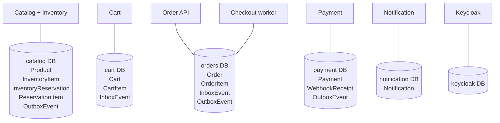
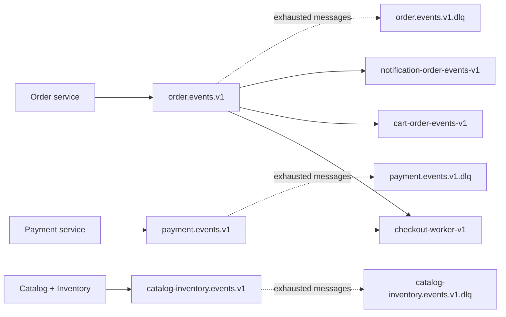
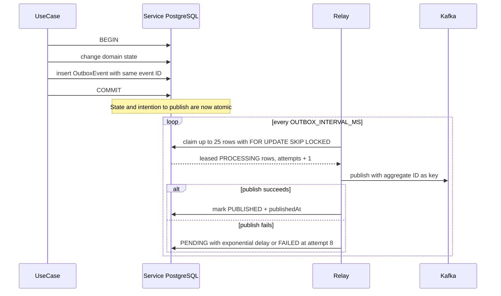
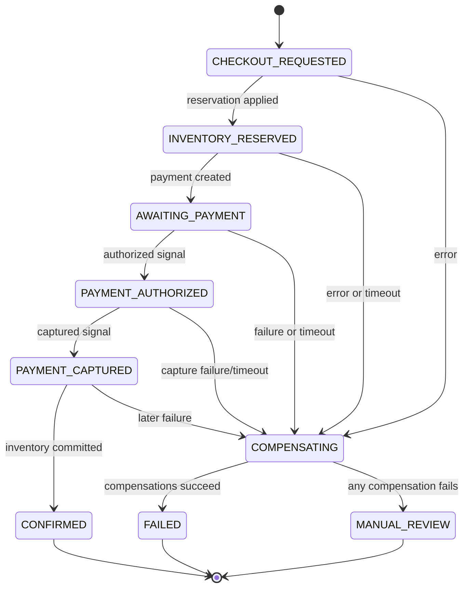
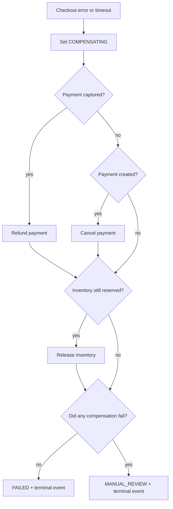

# Data, events, and checkout workflows

## 1. Data ownership

Every bounded context owns its schema, migrations, generated Prisma client, connection string, and database. The order API and checkout worker are the only two processes intentionally sharing a domain database because they are deployments of the same order bounded context.



Lines in this diagram represent process-to-owned-database access, not foreign keys between databases. There are no cross-service database queries.

### Catalog/inventory schema

| Model                  | Keys and invariants                               | Important fields                                                         |
| ---------------------- | ------------------------------------------------- | ------------------------------------------------------------------------ |
| `Product`              | UUID primary key, unique SKU                      | content, image, integer `priceAmount`, `currency`, `active`              |
| `InventoryItem`        | product ID primary/foreign key                    | `onHand`, `reserved`; migration check enforces `0 <= reserved <= onHand` |
| `InventoryReservation` | UUID primary key, unique order ID                 | lifecycle status, expiry time                                            |
| `ReservationItem`      | composite reservation/product key                 | quantity; migration check requires positive quantity                     |
| `OutboxEvent`          | event UUID primary key, status/availability index | topic, type, aggregate, JSON payload, attempts, lease/publication times  |

### Cart schema

| Model        | Keys and invariants              | Important fields              |
| ------------ | -------------------------------- | ----------------------------- |
| `Cart`       | UUID primary key, unique user ID | monotonic version, timestamps |
| `CartItem`   | composite cart/product key       | quantity and timestamps       |
| `InboxEvent` | event UUID primary key           | event type and processed time |

### Order schema

| Model         | Keys and invariants                                                   | Important fields                                                                       |
| ------------- | --------------------------------------------------------------------- | -------------------------------------------------------------------------------------- |
| `Order`       | UUID primary key, unique display ID, unique `(userId,idempotencyKey)` | identity/address/cart snapshots, state, reservation/payment IDs, total, failure reason |
| `OrderItem`   | composite order/product key                                           | quantity, later-enriched name and unit price                                           |
| `InboxEvent`  | event UUID primary key                                                | checkout/payment event deduplication                                                   |
| `OutboxEvent` | event UUID primary key                                                | checkout and terminal events plus relay metadata                                       |

Shipping address is stored as JSON because it is an immutable snapshot with a stable application schema, not a separately queried aggregate in this version.

### Payment schema

| Model            | Keys and invariants                                           | Important fields                                            |
| ---------------- | ------------------------------------------------------------- | ----------------------------------------------------------- |
| `Payment`        | UUID primary key, unique order ID, unique provider payment ID | owner, provider, client secret, amount, state, failure code |
| `WebhookReceipt` | provider event ID primary key                                 | event type and processed time                               |
| `OutboxEvent`    | event UUID primary key                                        | payment facts and relay metadata                            |

### Notification schema

| Model          | Keys and invariants               | Important fields                                                                      |
| -------------- | --------------------------------- | ------------------------------------------------------------------------------------- |
| `Notification` | UUID primary key, unique event ID | order/kind/recipient, rendered text and HTML, status, attempts, last error, sent time |

## 2. Money, time, and identifiers

- Monetary values are integers in Brazilian centavos, never floating-point major currency units. `54990` means BRL 549.90.
- Contracts fix currency to `BRL`.
- Browser/email formatting divides by 100 only for presentation.
- UUIDv7 is used for new orders, payments, events, carts, reservations, and notifications, giving unique values with rough temporal ordering.
- Event times are ISO UTC strings. Database timestamps use PostgreSQL/Prisma `DateTime`.
- Cursor pagination uses UUID IDs. Catalog sorts ascending; orders sort descending.

## 3. Event envelope and contracts

Every integration event has this logical shape:

```json
{
  "eventId": "UUIDv7",
  "eventType": "order.confirmed.v1",
  "eventVersion": 1,
  "occurredAt": "ISO-8601 UTC timestamp",
  "producer": "order-service",
  "aggregateId": "order UUID",
  "correlationId": "request/workflow correlation UUID",
  "causationId": "optional UUID",
  "traceparent": "optional W3C trace context",
  "data": {}
}
```

`eventType` includes the semantic version suffix. The Zod registry selects the correct payload schema and consumers parse the entire envelope before using data. `aggregateId` is also used as the Kafka message key, so events for one order are routed consistently within a topic's partitions.

### Topics and topology



| Event                      | Producer          | Current consumers                  | Purpose                                            |
| -------------------------- | ----------------- | ---------------------------------- | -------------------------------------------------- |
| `checkout.requested.v1`    | order             | checkout worker                    | start the durable Saga                             |
| `payment.authorized.v1`    | payment           | checkout worker                    | signal that capture may begin                      |
| `payment.captured.v1`      | payment           | checkout worker                    | signal authoritative captured state                |
| `payment.failed.v1`        | payment           | checkout worker                    | fail and compensate checkout                       |
| `payment.refunded.v1`      | declared contract | none; not currently emitted        | reserved contract surface for refund fact          |
| `order.confirmed.v1`       | order             | cart, notification; worker ignores | remove purchased cart quantities and email success |
| `order.checkout_failed.v1` | order             | notification; cart/worker ignore   | email failure/manual-review outcome                |
| `inventory.reserved.v1`    | catalog/inventory | none currently                     | reservation fact/integration surface               |
| `inventory.committed.v1`   | catalog/inventory | none currently                     | committed stock fact/integration surface           |
| `inventory.released.v1`    | catalog/inventory | none currently                     | released stock fact/integration surface            |

Each source topic has a parallel `.dlq` topic created by the local `kafka-init` container.

## 4. Transactional outbox

Order, payment, and catalog/inventory produce events through the transactional outbox pattern.



Claiming behavior supports multiple relay replicas:

- `FOR UPDATE SKIP LOCKED` prevents two active relays claiming the same row concurrently.
- A 30-second `availableAt` lease makes a crashed `PROCESSING` row eligible again.
- Up to 25 oldest eligible events are claimed per cycle.
- Retry delay starts at one second, doubles, and caps at 60 seconds.
- After eight attempts the row becomes `FAILED` and an exhaustion metric increments.

There is still a normal at-least-once edge: Kafka can accept a publish and the process can crash before marking the outbox row `PUBLISHED`. The row will publish again after its lease. Consumers must therefore deduplicate.

## 5. Inbox and other deduplication boundaries

Different duplicate sources require different mechanisms:

| Boundary               | Mechanism                                          | Duplicate prevented                                     |
| ---------------------- | -------------------------------------------------- | ------------------------------------------------------- |
| checkout HTTP          | unique `(userId, idempotencyKey)`                  | browser/network retry creating another order            |
| inventory reserve      | unique reservation `orderId`                       | workflow activity retry double-reserving stock          |
| inventory transitions  | state-aware idempotent transition                  | duplicate commit/release                                |
| payment create         | unique payment `orderId`                           | activity retry creating another internal payment        |
| Stripe commands        | provider idempotency keys like `{orderId}:capture` | duplicate provider operation                            |
| Stripe webhooks        | unique `WebhookReceipt.providerEventId`            | repeated provider delivery                              |
| workflow start         | deterministic `checkout-{orderId}`                 | duplicate workflow execution                            |
| checkout Kafka handler | order `InboxEvent`                                 | duplicate start/signal handling                         |
| cart confirmed handler | cart `InboxEvent`, in same transaction as effect   | duplicate quantity subtraction                          |
| notification handler   | unique `Notification.eventId`; skip if sent        | normal duplicate email handling                         |
| Kafka itself           | consumer group offsets plus handler retry/DLQ      | load sharing and eventual progress, not business dedupe |

The checkout worker records its inbox event after successfully starting/signaling Temporal. Cart records the inbox row atomically with cart mutation. Notification persists before sending, but SMTP/SES cannot participate in the database transaction, so a crash after provider acceptance can still create a duplicate external email.

## 6. Successful checkout sequence

```mermaid
sequenceDiagram
  autonumber
  actor Buyer
  participant Web
  participant Kong
  participant Order as Order API
  participant Cart
  participant Kafka
  participant Worker as Checkout worker
  participant Temporal
  participant Inventory as Catalog + Inventory
  participant Payment
  participant Stripe
  participant Notify as Notification

  Buyer->>Web: submit shipping address
  Web->>Kong: POST /api/v1/orders/checkout + Idempotency-Key
  Kong->>Order: authenticated request + correlation ID
  Order->>Cart: protected cart snapshot
  Cart-->>Order: cart ID/version/items
  Order->>Order: transaction: order, items, checkout outbox
  Order-->>Web: 202 Accepted + order ID/status URL
  Order->>Kafka: checkout.requested.v1 via relay
  Kafka->>Worker: checkout event
  Worker->>Temporal: start checkout-{orderId}
  Temporal->>Worker: run deterministic workflow/activity tasks

  Worker->>Inventory: reserve product quantities
  Inventory->>Inventory: atomically increment reserved + outbox
  Inventory-->>Worker: reservation, canonical names/prices, expiry
  Worker->>Order: enrich snapshot and total
  Worker->>Payment: create manual-capture payment
  Payment->>Stripe: create PaymentIntent
  Stripe-->>Payment: client secret, requires action
  Payment-->>Worker: internal payment ID
  Worker->>Order: AWAITING_PAYMENT

  Web->>Order: poll every 2 seconds
  Web->>Payment: get owned payment session
  Buyer->>Stripe: confirm Payment Element
  Stripe->>Payment: signed amount_capturable_updated webhook
  Payment->>Payment: webhook receipt + AUTHORIZED + outbox
  Payment->>Kafka: payment.authorized.v1
  Kafka->>Worker: signal paymentAuthorized
  Worker->>Order: PAYMENT_AUTHORIZED
  Worker->>Payment: capture with idempotency key
  Payment->>Stripe: capture PaymentIntent
  Stripe->>Payment: signed payment_intent.succeeded webhook
  Payment->>Payment: CAPTURED + outbox
  Payment->>Kafka: payment.captured.v1
  Kafka->>Worker: signal paymentCaptured

  Worker->>Order: PAYMENT_CAPTURED
  Worker->>Inventory: commit reservation
  Inventory->>Inventory: reserved -= quantity; onHand -= quantity
  Worker->>Order: transaction: CONFIRMED + terminal outbox
  Order->>Kafka: order.confirmed.v1
  Kafka->>Cart: remove only purchased snapshot quantities
  Kafka->>Notify: render and send confirmation
  Web->>Order: poll returns CONFIRMED; stop polling
```

The browser is never the authority for payment state. It confirms payment with Stripe, but only a verified Stripe webhook causes a real payment event, which then signals the workflow.

## 7. Order state machine



`INVENTORY_RESERVED`, `AWAITING_PAYMENT`, `PAYMENT_AUTHORIZED`, and `PAYMENT_CAPTURED` are set by workflow activities. The terminal state transition and terminal outbox event are atomic in the order database.

## 8. Temporal workflow behavior

The deterministic workflow stores only local state and calls proxied activities for I/O. Its important variables are:

- `paymentState`: `WAITING`, `AUTHORIZED`, `CAPTURED`, or `FAILED`;
- `reserved`: whether inventory must still be released;
- `paymentCreated`: whether cancel/refund may be required;
- `captured`: whether refund is required instead of cancel; and
- `paymentId`: reference needed for compensation.

The workflow installs signal handlers before starting activities. It then waits up to `PAYMENT_WINDOW_MS` for a non-waiting payment signal and up to `PAYMENT_CAPTURE_WINDOW_MS` for captured/failed after requesting capture. Local defaults are 15 minutes and 2 minutes; E2E overrides use 30 seconds and 10 seconds.

Temporal records activity results, timers, and signals in workflow history. A worker restart can replay deterministic code and continue. Workflow code must not add normal I/O, current-time reads, random values, or incompatible branching without Temporal versioning/patch rules.

## 9. Compensation policy

The pure `compensationSteps` policy chooses reverse actions from reached state:



Refund/cancel is attempted before inventory release because a captured financial inconsistency is the higher-risk side effect. Each compensation activity has the same bounded Temporal retry policy as forward activities. If retries still fail, the order retains its payment/reservation references and moves to manual review for an operator.

## 10. Failure routing and DLQs

Kafka handlers get three in-process attempts by default. Each delay doubles from the configured base. If parsing fails or all handler attempts fail, the raw original value is sent to the source topic's `.dlq` with error metadata. Because the handler returns after DLQ publication, the main consumer can advance rather than loop forever on a poison message.

Outbox failure and consumer failure are distinct:

- an outbox failure means a service could not publish its own fact; it remains in that service database and eventually becomes `FAILED` after eight claims;
- a consumer/DLQ failure means Kafka already contains the fact, but one consumer could not apply it after bounded retries.

Both have dedicated metrics, alerts, and runbooks under `docs/runbooks`.
