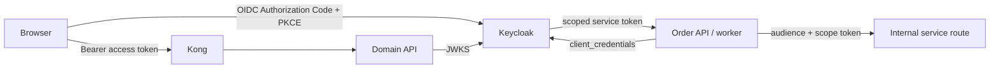
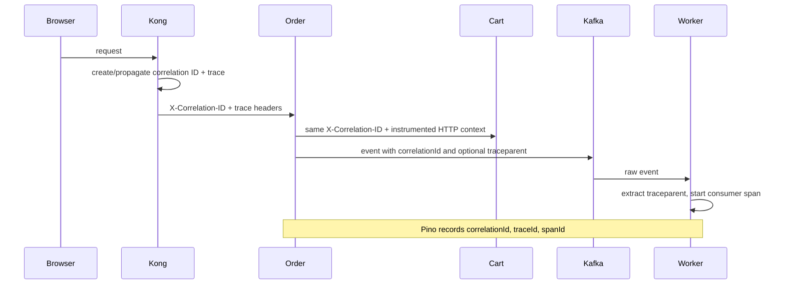
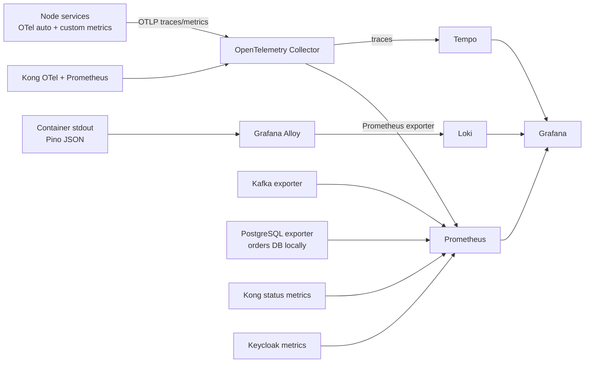

# Security, observability, and reliability

## 1. Security model

Northstar uses defense in depth. Kong is the public routing and traffic-control boundary, but each domain API remains responsible for validating identity, permissions, input, and resource ownership.

## 2. Buyer authentication

The Keycloak realm contains:

- a public `ecommerce-web` client for the SPA;
- buyer identity/role configuration;
- access-token mappers for subject, email, preferred username, and the `web-app` audience; and
- a seeded local demo buyer for study use.

The browser uses Authorization Code with PKCE S256 through `keycloak-js`. It never stores or receives a confidential client secret. Before backend requests, the auth provider refreshes tokens approaching expiry.

Cart, order, and payment public routes verify:

1. bearer token presence;
2. signature through Keycloak JWKS;
3. issuer;
4. `web-app` audience; and
5. a subject claim.

The order checkout also requires an email claim. Owned reads derive the user from `sub` and filter by it. A caller probing another user's order or payment receives the same not-found response used for an absent resource, limiting information disclosure.

## 3. Service authentication and authorization

The confidential `order-service` Keycloak client has service accounts enabled and receives scopes for `cart:read`, `inventory:write`, and `payment:write`. Audience protocol mappers add the relevant internal service audiences.

The order API and worker use a cached client-credentials token. Internal services verify both the target audience and required scope:

| Target            | Audience                    | Required scope    | Used for                                  |
| ----------------- | --------------------------- | ----------------- | ----------------------------------------- |
| cart              | `cart-service`              | `cart:read`       | immutable cart snapshot at checkout start |
| catalog/inventory | `catalog-inventory-service` | `inventory:write` | reserve, commit, release                  |
| payment           | `payment-service`           | `payment:write`   | create, capture, cancel, refund           |

Internal routes are omitted from Kong entirely. Network reachability plus a valid scoped token is required in normal mode.

`AUTH_DISABLED=true` bypasses JWT validation and uses test identity headers. Compose enables it only in `compose.e2e.yaml`; it must not be used in shared development or production environments. Payment adds a second safety check: the fake provider is rejected unless `NODE_ENV=test`.

## 4. Kong edge controls

Kong runs DB-less from [`infra/kong/kong.yml`](../../infra/kong/kong.yml), so the route/plugin configuration is version controlled.

Public routes cover:

- catalog product reads;
- owned cart APIs;
- owned order APIs;
- payment sessions;
- Stripe webhooks; and
- the test authorization route, though the payment service itself registers it only in test/fake mode.

Global plugins provide:

| Plugin                | Function                                                                               |
| --------------------- | -------------------------------------------------------------------------------------- |
| correlation ID        | generate or propagate `X-Correlation-ID` and echo it downstream                        |
| CORS                  | local storefront origin, allowed methods/headers, exposed correlation/location headers |
| request-size limiting | reject payloads above 1 MB at the gateway                                              |
| rate limiting         | 300 requests/minute/IP globally                                                        |
| Prometheus            | gateway status, latency, and upstream health metrics                                   |
| OpenTelemetry         | gateway traces to the local collector                                                  |

The Stripe webhook route has a tighter 120 requests/minute/IP plugin. Services add smaller JSON/raw-body limits as another layer.

Kong's Admin API binds only to loopback in Compose and is not published. In AWS, only Kong and Keycloak are attached to ALB target groups; internal services remain reachable through ECS Service Connect.

## 5. Input, error, and payment security

### Input and errors

- Zod validates route bodies, query strings, parameters, events, and configuration.
- Express limits normal JSON bodies to 128 or 256 KB and Stripe raw bodies to 512 KB.
- Expected failures use stable machine codes through `AppError`.
- Unexpected 500 errors return a generic message and omit internal details.
- Every response includes a correlation reference that can be shared with operators.

### Stripe boundary

- Only Stripe test keys are intended for local use.
- Card data is collected by Stripe Payment Element, not the application server.
- PaymentIntents use card-only, manual capture.
- Stripe webhook verification uses the unmodified raw request body and `Stripe-Signature`.
- Webhook IDs are stored before repeat delivery can apply the same state twice.
- Payment sessions check user ownership before returning a client secret.
- Provider commands use idempotency keys.
- Secret keys and webhook secrets remain backend configuration.

### Data minimization and log redaction

The Pino logger redacts authorization values, tokens, client secrets, email fields, recipient email, shipping addresses, and Stripe payload fields. Services log structured metadata rather than raw payment/webhook/customer payloads. The browser sees only the provider client secret required by Stripe.js and public catalog/order data owned by that user.

## 6. Correlation and trace propagation

Correlation IDs and distributed trace context solve related but different problems:

- `X-Correlation-ID` is an application-visible UUID returned to the browser and placed in logs.
- W3C trace context connects sampled spans across instrumented HTTP and Kafka operations.

The shared Kafka adapter sets producer/consumer span attributes including topic, partition, offset, event ID, and correlation ID. If `traceparent` is present in the event envelope, consumer handling runs inside the extracted context.

The envelope and consumer support cross-topic W3C context, but current producer call sites do not populate `traceparent`. Kafka operations still create local producer/consumer spans and preserve `correlationId`; a continuous parent/child trace across the broker requires injecting the active trace context when each event is created.

## 7. Local observability pipeline

The full Compose profile builds a three-signal local stack around OpenTelemetry and structured stdout logs.

### Component roles

| Component              | Role                                                                             |
| ---------------------- | -------------------------------------------------------------------------------- |
| OpenTelemetry Node SDK | auto-instrument HTTP/runtime libraries and export explicit business metrics      |
| OTel Collector         | receive OTLP, add local environment resource, batch, limit memory, route signals |
| Tempo                  | retain local traces for 24 hours                                                 |
| Prometheus             | scrape metrics, evaluate alert rules, serve time series                          |
| Loki                   | retain local container logs for 24 hours                                         |
| Alloy                  | discover Docker containers, parse Pino JSON, label logs, send to Loki            |
| Grafana                | pre-provisioned Prometheus/Tempo/Loki data sources and overview dashboard        |
| Kafka exporter         | consumer lag metrics                                                             |
| PostgreSQL exporter    | database metrics; current Compose targets only the orders database               |

Grafana links Tempo traces to Loki logs by trace ID and derives trace links from JSON log fields.

### Explicit metrics

| Metric family                             | What it reveals                                  |
| ----------------------------------------- | ------------------------------------------------ |
| HTTP server duration/count                | request rate, errors, latency by service/status  |
| messaging consumer duration/failures/DLQ  | handler performance and poison messages          |
| outbox event age/exhausted                | publication delay and permanent relay failure    |
| checkout completed/duration/manual review | business outcome and Saga health                 |
| Stripe webhook received/failures          | provider ingress and signature/processing errors |
| inventory reservation released            | compensation activity                            |
| Kafka consumer lag                        | asynchronous backlog                             |

Starter alerts cover HTTP 5xx rate, Kafka lag, manual review, DLQ publication, outbox exhaustion/age, Stripe webhook failures, checkout failure rate, and exporter/Keycloak/Kong availability.

## 8. Health and readiness

All domain services expose:

- `/health/live`: returns `200` when the process can answer HTTP;
- `/health/ready`: runs a PostgreSQL `SELECT 1` and returns `200` or `503`.

The checkout worker's small health server returns success after startup without a per-request PostgreSQL/Kafka/Temporal check. Docker Compose uses these endpoints to order dependent startup. ECS task definitions use the configured health path in a container health command.

Readiness is intentionally narrower than complete end-to-end health. A database-ready service can still experience Kafka, Keycloak, Stripe, Temporal, or downstream failures; metrics and workflow/outbox state cover those failure modes.

## 9. Reliability mechanisms

| Failure source                 | Mechanism                                                            |
| ------------------------------ | -------------------------------------------------------------------- |
| database/Kafka dual write      | transactional outbox                                                 |
| duplicate Kafka delivery       | service-owned inbox/idempotency records                              |
| relay replica races            | `FOR UPDATE SKIP LOCKED` claims and leases                           |
| relay crash after claim        | 30-second lease recovery                                             |
| transient publish failure      | eight attempts with bounded exponential delay                        |
| poison consumer message        | three handler attempts then `.dlq`                                   |
| workflow/API/worker restart    | Temporal workflow history and replay                                 |
| transient activity failure     | five Temporal attempts with exponential backoff                      |
| permanent 4xx business failure | non-retryable Temporal application failure                           |
| duplicate workflow event       | deterministic workflow ID and order inbox                            |
| duplicate Stripe delivery      | webhook receipt ID                                                   |
| duplicate provider command     | Stripe idempotency keys                                              |
| mid-checkout failure           | cancel/refund/release compensation                                   |
| compensation failure           | explicit `MANUAL_REVIEW` state and alert                             |
| process termination            | SIGINT/SIGTERM shutdown of servers, consumers, clients, Prisma, OTel |

## 10. Reliability semantics to keep in mind

- The system provides at-least-once event delivery, not exactly once.
- A `202` checkout response means the request is durably accepted, not completed.
- A successful synchronous Stripe call is not the order's authoritative payment fact; verified webhook state is.
- A published terminal order event can reach cart and notification at different times.
- The UI polls and is eventually consistent with background workflow state.
- `MANUAL_REVIEW` is a safety outcome, not just a generic error.
- DLQ publication keeps the main consumer progressing but requires an operator replay/remediation process.
- Outbox rows marked `FAILED` remain evidence in the producer database and require operational handling.

## 11. AWS security posture in the Terraform reference

The AWS design adds private ECS tasks, private encrypted RDS instances, MSK IAM authentication, Secrets Manager injection, immutable/scanned ECR images, private S3 behind CloudFront OAC, and GitHub OIDC instead of long-lived deployment credentials. The ALB's default response is 403, and forwarding rules require a secret header added by CloudFront.

The reference remains a dev/study topology, not a completed production security baseline. It lacks WAF, custom-domain certificate wiring, Multi-AZ RDS, deletion protection/final snapshots, validated backup/restore, and a complete managed observability design. The existing [threat model](../security/threat-model.md) contains the dedicated threat analysis.
