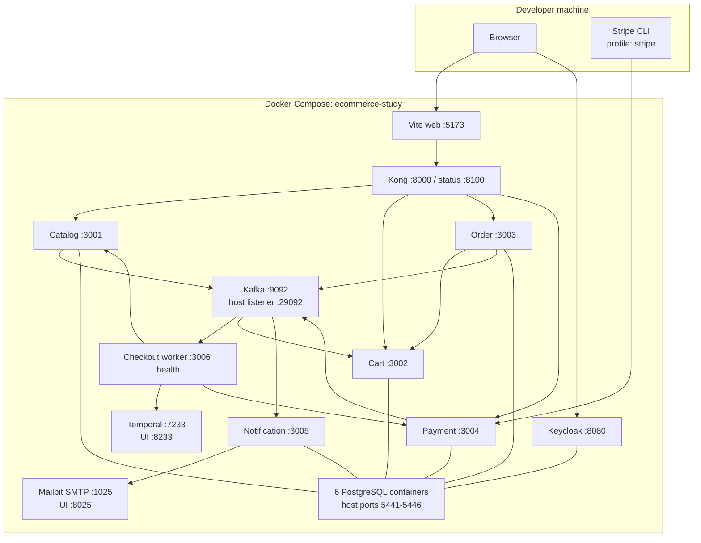
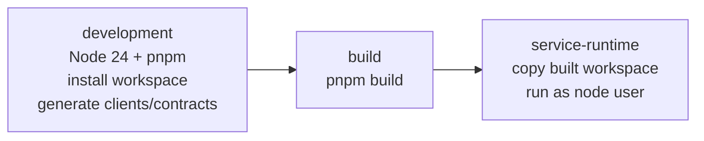
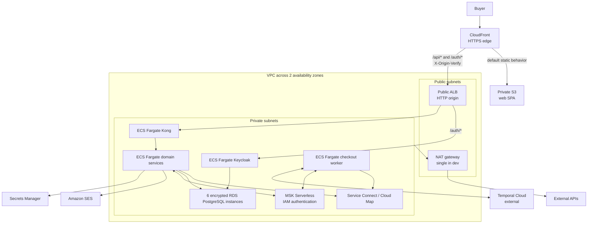
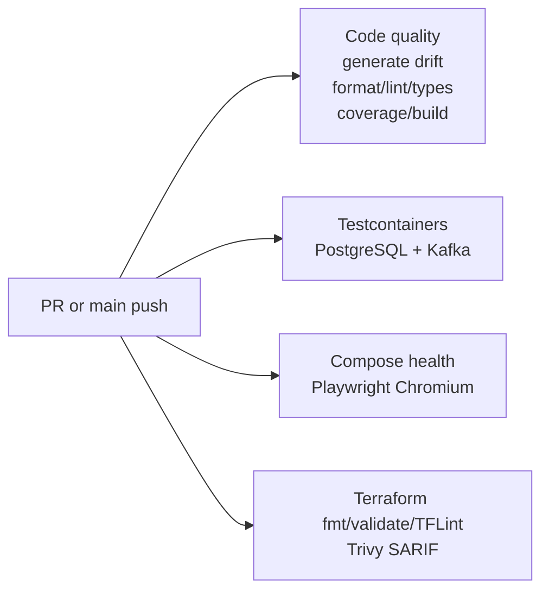
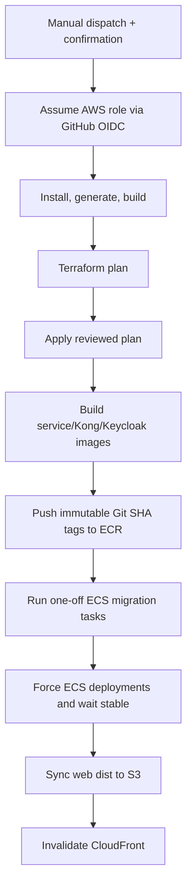

# Infrastructure and deployment

## 1. Local platform with Docker Compose

[`compose.yaml`](../../compose.yaml) defines the complete local platform under Compose project name `ecommerce-study`. The default/lite stack runs the product; optional profiles add observability, operator tools, or Stripe webhook forwarding.

### Default application and platform containers

| Container         | Image or build                | Purpose                                                              |
| ----------------- | ----------------------------- | -------------------------------------------------------------------- |
| `catalog-db`      | PostgreSQL 18                 | catalog/inventory database                                           |
| `cart-db`         | PostgreSQL 18                 | cart database                                                        |
| `order-db`        | PostgreSQL 18                 | order/worker database                                                |
| `payment-db`      | PostgreSQL 18                 | payment database                                                     |
| `notification-db` | PostgreSQL 18                 | notification database                                                |
| `keycloak-db`     | PostgreSQL 18                 | identity database                                                    |
| `kafka`           | Apache Kafka 4.2              | single-node KRaft broker/controller with internal and host listeners |
| `kafka-init`      | Apache Kafka 4.2              | one-shot creation of source and DLQ topics                           |
| `temporal`        | Temporal dev server           | workflow service, SQLite persistence, and UI                         |
| `mailpit`         | Mailpit                       | local SMTP capture and browser inbox                                 |
| `keycloak`        | Keycloak 26                   | imported realm, buyer login, service credentials                     |
| five services     | shared Node development image | migrations plus source watch process                                 |
| `checkout-worker` | shared Node development image | migrations plus Temporal/Kafka worker watch process                  |
| `kong`            | Kong 3.9                      | DB-less public gateway                                               |
| `web`             | shared Node development image | Vite dev server                                                      |

PostgreSQL health checks use `pg_isready`. Kafka topic creation waits for broker health. Application containers run Prisma deploy migrations before watch mode; catalog also runs the idempotent seed. Kong waits for public backend services to report healthy. Compose uses named volumes for data persistence.

### Profiles

| Profile                      | Containers                                                         | Reason to enable                                |
| ---------------------------- | ------------------------------------------------------------------ | ----------------------------------------------- |
| default (`pnpm dev:lite`)    | application plus core platform                                     | normal development                              |
| `stripe` (`pnpm dev:stripe`) | Stripe CLI                                                         | receive and forward signed Stripe test webhooks |
| `observability`              | OTel Collector, Tempo, Loki, Alloy, Prometheus, exporters, Grafana | traces, metrics, logs, dashboard, alerts        |
| `tools`                      | Kafka UI                                                           | inspect topics, messages, groups, and lag       |

`pnpm dev:full` enables observability and tools. The full stack needs substantially more memory than the lite stack.

### Compose Watch

Every Node container uses the same development image and a Compose Watch rule that synchronizes repository source into `/workspace`. Dependency metadata, lockfiles, manifests, Dockerfile, generated build output, and caches are excluded. A source-only edit is therefore hot-reloaded by `tsx watch`/Vite without rebuilding the image.

Changing a package manifest, lockfile, workspace definition, or Dockerfile requires stopping and rebuilding the stack because those files define the cached install layer.

## 2. Isolated E2E Compose overlay

[`compose.e2e.yaml`](../../compose.e2e.yaml) overlays the normal topology for deterministic browser tests:

- removes source-watch volumes;
- sets `NODE_ENV=test`;
- disables JWT validation in the isolated stack;
- switches payment to the fake provider;
- shortens reservation/payment timers; and
- configures the frontend to send deterministic test identity headers.

The runner uses fixed project name `ecommerce-e2e`, waits for every health check, runs Playwright, prints selected container logs on failure, and always removes only that project's containers and volumes in `finally`.

## 3. Dockerfile stages

[`Dockerfile`](../../Dockerfile) has three stages:

### `development`

- starts from the pinned Node 24 slim image;
- installs CA certificates and OpenSSL;
- activates pnpm 11 through Corepack;
- copies manifests before source to maximize dependency-layer reuse;
- uses a BuildKit cache mount for the pnpm store;
- copies the repository; and
- runs all generation.

All development application containers reuse this same image and override the command.

### `build`

Runs the workspace production build after generation.

### `service-runtime`

Starts from a clean Node slim image, copies the built workspace, switches to the non-root `node` user, and supplies a default order-service command that ECS task definitions override per service.

Kong and Keycloak have separate small Dockerfiles that copy their declarative configuration/realm into the official images for AWS deployment.

## 4. AWS reference architecture

Terraform under [`infra/terraform`](../../infra/terraform/) models a manually deployed dev/study environment.

### Network module

The network module creates:

- a DNS-enabled `/16` VPC;
- two public and two private subnets by default;
- an internet gateway;
- public/private route tables; and
- either one NAT gateway for cost-oriented dev or one per availability zone.

The dev composition uses a single NAT gateway, so outbound connectivity is cheaper but not AZ-resilient.

### Data module

The data module creates six separate PostgreSQL 17 RDS instances for catalog, cart, orders, payment, notification, and Keycloak. Each receives:

- private subnet placement;
- an encrypted GP3 volume;
- a generated password;
- a Secrets Manager JSON secret containing credentials and URL;
- a database-specific tag; and
- VPC-only port 5432 access.

The dev defaults are intentionally inexpensive rather than production-safe: `db.t4g.micro`, no Multi-AZ, one-day backup retention, no deletion protection, and no final snapshot.

### Messaging module

The messaging module creates MSK Serverless in private subnets. Port 9098 is available only inside the VPC. Client authentication uses IAM SASL; the shared Kafka package obtains short-lived signed bearer tokens from the task role.

### Compute module

The compute module creates:

- an ECS cluster with Container Insights;
- ECR repositories with immutable tags, scan-on-push, encryption, and a 20-image lifecycle;
- ECS execution/task roles;
- CloudWatch log groups with 14-day retention;
- one Fargate task definition and ECS service per configured process;
- Service Connect/Cloud Map internal DNS names;
- CPU target-tracking autoscaling from one to four tasks;
- an origin-facing ALB and target groups for only Kong/Keycloak; and
- deployment circuit breakers with automatic rollback.

The task role can connect/read/write MSK topics/groups and send SES email. The execution role can pull images, emit logs, and retrieve Secrets Manager values. Application services normally run as UID 1000.

Only Kong and Keycloak are public ALB targets. ALB rules require `X-Origin-Verify`, a random secret injected by CloudFront; the default action is 403. Services communicate through stable Service Connect names such as `cart`, `payment`, and `catalog-inventory`.

### Edge module

The edge module creates:

- a private, encrypted S3 bucket for the built SPA;
- CloudFront Origin Access Control for S3;
- a CloudFront distribution using the default certificate/domain;
- cached static default behavior;
- non-cached `/api/*` and `/auth/*` behaviors to the ALB;
- the secret origin header; and
- SPA fallback of S3 403/404 responses to `index.html`.

The browser therefore uses one CloudFront origin for static content, API paths, and Keycloak paths.

### Secrets and external services

Terraform stores Stripe secret/webhook keys, Temporal API key, Keycloak admin password, order-service client secret, and database credentials in Secrets Manager. Temporal Cloud remains external and is configured with address, namespace, TLS, and API key. SES identity is created from a supplied verified address/domain value.

## 5. Terraform bootstrap and state

The bootstrap stack creates a private, versioned, AES256-encrypted S3 bucket for Terraform state. The dev environment configures the S3 backend through `backend.hcl`; state locking uses the S3 lockfile feature.

Terraform requires a deliberate sequence:

1. apply the bootstrap once;
2. copy/configure backend and variables;
3. initialize the dev environment;
4. review a plan and costs; and
5. apply only in an owned AWS account.

Nothing in normal CI automatically applies AWS infrastructure.

## 6. Continuous integration

The main CI workflow runs on pull requests and `main` pushes with four jobs:

- **Code quality:** frozen install, generation, drift check, formatting, lint, typecheck, coverage, build.
- **Integration:** disposable PostgreSQL/Kafka tests.
- **Compose and E2E:** Compose config validation, isolated full stack, Chromium scenarios, failure artifact upload.
- **Infrastructure/security:** Terraform formatting/validation, TFLint, Trivy filesystem scan, SARIF upload.

Concurrency cancels an older CI run on the same ref.

## 7. Manual dev deployment workflow

[`deploy-dev.yml`](../../.github/workflows/deploy-dev.yml) is `workflow_dispatch` only and requires a confirmation input plus a protected `dev` environment. GitHub exchanges its OIDC token for a narrowly scoped AWS role; no static AWS access key is stored.

Database migrations run before rolling services, following an expand-compatible expectation. The workflow builds one shared service runtime image and tags/pushes it into the repositories for catalog, cart, order, worker, payment, and notification. Kong and Keycloak use their own images.

## 8. Current deployment caveats

The Terraform environment is explicitly a reference that has not been applied/verified by this implementation. Before treating it as deployable production infrastructure, validate:

- account quotas, current container images, MSK IAM resource ARN policies, Service Connect, and Keycloak realm import behavior;
- custom domain, Route 53, ACM certificate, end-to-end TLS, and WAF;
- RDS Multi-AZ, backup/restore, deletion protection, performance monitoring, and cost;
- production telemetry collection (the Terraform composition supplies CloudWatch logs but does not set an OTLP endpoint by default);
- autoscaling behavior for Kafka consumers/Temporal workers, where CPU scaling alone may not reflect backlog;
- topic creation/retention/partition policy in MSK rather than relying on local auto-create behavior;
- SES verification/sandbox state;
- Temporal Cloud connectivity and replay compatibility; and
- frontend build variables. The deployment workflow currently builds the SPA without explicitly injecting `VITE_KEYCLOAK_URL`, realm/client ID, API base URL, or Stripe publishable key. The API client can use same-origin defaults, but Keycloak and Stripe require correct build-time values for a real deployed browser.

The existing [AWS cost warning](../aws-costs.md) and [deployment runbook](../runbooks/aws-deployment.md) should be read before any apply.
