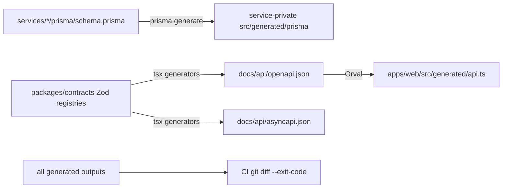

# Development, testing, and reference

## 1. Prerequisites and first run

Recommended local prerequisites:

- Docker Desktop with Compose v2;
- at least 12 GB assigned to Docker for the normal stack; 16 GB is more comfortable for the full observability stack;
- Node.js 24.x;
- Corepack; and
- Stripe test credentials only when testing the real payment path.

PowerShell quick start:

```powershell
Copy-Item .env.example .env
corepack enable
pnpm install --frozen-lockfile
pnpm dev:lite
```

Compose deploys migrations and seeds the catalog automatically. Wait for health checks before opening `http://localhost:5173`.

## 2. Root commands

| Command                 | What it does                                                                |
| ----------------------- | --------------------------------------------------------------------------- |
| `pnpm build`            | Turborepo production build across workspaces                                |
| `pnpm dev`              | run workspace development processes in parallel without platform containers |
| `pnpm dev:lite`         | build/start/watch the core Compose stack                                    |
| `pnpm dev:full`         | add observability and Kafka UI profiles                                     |
| `pnpm dev:stripe`       | run Stripe CLI webhook forwarding profile                                   |
| `pnpm down`             | stop normal/full profiles while preserving named volumes                    |
| `pnpm clean`            | clean workspace outputs plus root cache/coverage/test reports               |
| `pnpm format`           | rewrite files with Prettier                                                 |
| `pnpm format:check`     | verify formatting without writes                                            |
| `pnpm lint`             | type-aware ESLint through the workspace graph                               |
| `pnpm typecheck`        | strict TypeScript checks, after generation                                  |
| `pnpm test`             | fast workspace unit tests                                                   |
| `pnpm test:coverage`    | root Vitest coverage run with thresholds                                    |
| `pnpm test:integration` | integration configuration; Docker tests run when enabled by environment     |
| `pnpm test:e2e`         | isolated Compose stack plus Playwright, then cleanup                        |
| `pnpm test:e2e:running` | Playwright against an already-running suitable stack                        |
| `pnpm generate`         | Prisma clients, OpenAPI, AsyncAPI, and Orval client                         |
| `pnpm check`            | format check, lint, typecheck, unit tests, and build                        |

Run one workspace with pnpm filtering, for example:

```bash
pnpm --filter @ecommerce/order-service test
pnpm --filter @ecommerce/payment-service typecheck
pnpm --filter @ecommerce/web dev
```

The order service has separate `dev` and `dev:worker` scripts. Service database scripts are `db:migrate` for interactive development and `db:deploy` for applying committed migrations.

## 3. Generation pipeline



Generated Prisma code should not be edited. Change the schema/migration and regenerate. OpenAPI/AsyncAPI should be changed through Zod registries/generator code rather than editing JSON. The current UI runtime uses the hand-written client, but the generated Orval output is still kept current as a contract artifact.

## 4. Test strategy

### Unit tests

Vitest workspace tests cover:

- domain invariants such as cart quantity and order compensation order;
- application decisions and repository/provider port interactions;
- event envelope parsing and HTTP contract rules;
- request correlation, validation, async forwarding, and safe Problem Details;
- authentication token behavior and Keycloak realm claims;
- Kafka in-memory behavior;
- notification templates and delivery state handling;
- frontend formatting, auth initialization, and shared UI states.

The coverage configuration focuses on domain/application/shared technical code and excludes generated code and most infrastructure adapters. Thresholds are 80% for service domain/application code and 70% overall for branches, functions, lines, and statements.

### Integration tests

`RUN_INTEGRATION_TESTS=true pnpm test:integration` enables disposable PostgreSQL and Kafka containers through Testcontainers. The current suite verifies real infrastructure endpoints and the Stripe signature fixture structure. It is serialized with one worker and 120-second test/hook timeouts.

This layer is currently a platform smoke test, not a complete repository/migration/API integration matrix.

### End-to-end tests

After one-time browser installation:

```bash
pnpm exec playwright install chromium
pnpm test:e2e
```

Playwright runs two Chromium journeys:

1. browse the seeded catalog; and
2. add a keyboard, view cart, submit an address, start checkout, authorize fake payment, wait for durable confirmation, and verify order history.

The journey uses real Express services, PostgreSQL, Kafka, Temporal, outbox/inbox logic, Kong, and the React app. JWT verification and Stripe are replaced only by explicit E2E-mode adapters. Failure traces/screenshots/reports and selected service logs make failures diagnosable.

### Manual real-Stripe test

Automated CI does not call Stripe. To exercise the real path:

1. place Stripe test secret, webhook secret, and publishable key in `.env`;
2. start `pnpm dev:lite`;
3. start `pnpm dev:stripe`;
4. replace the webhook secret with the `whsec_...` value printed by Stripe CLI if needed; and
5. use only Stripe test cards through the storefront.

The webhook forwarder sends signed payloads to the payment service inside Compose.

## 5. Local ports and credentials

| Resource            | Host address            | Notes                                                               |
| ------------------- | ----------------------- | ------------------------------------------------------------------- |
| storefront          | `http://localhost:5173` | buyer SPA                                                           |
| Kong API            | `http://localhost:8000` | only public backend entry                                           |
| Kong status/metrics | `http://localhost:8100` | status listener; metrics path used by Prometheus                    |
| Keycloak            | `http://localhost:8080` | demo `buyer` / `buyer123`; admin password defaults to `local-admin` |
| Temporal gRPC       | `localhost:7233`        | worker/client connection                                            |
| Temporal UI         | `http://localhost:8233` | workflow inspection                                                 |
| Mailpit SMTP        | `localhost:1025`        | notification adapter target                                         |
| Mailpit UI          | `http://localhost:8025` | captured email                                                      |
| Kafka host listener | `localhost:29092`       | plaintext developer access                                          |
| catalog DB          | `localhost:5441`        | database credentials in Compose                                     |
| cart DB             | `localhost:5442`        | database credentials in Compose                                     |
| order DB            | `localhost:5443`        | database credentials in Compose                                     |
| payment DB          | `localhost:5444`        | database credentials in Compose                                     |
| notification DB     | `localhost:5445`        | database credentials in Compose                                     |
| Keycloak DB         | `localhost:5446`        | database credentials in Compose                                     |
| Grafana             | `http://localhost:3000` | full profile, default admin/admin                                   |
| Prometheus          | `http://localhost:9090` | full profile                                                        |
| Tempo               | `http://localhost:3200` | full profile                                                        |
| Loki                | `http://localhost:3100` | full profile                                                        |
| Kafka UI            | `http://localhost:8088` | tools profile                                                       |

Application service ports 3001–3006 are internal to Compose and are not published to the host; Kong is the supported public route.

## 6. Public API quick reference

| Method | Route                                        | Owner   | Auth                            |
| ------ | -------------------------------------------- | ------- | ------------------------------- |
| GET    | `/api/v1/products`                           | catalog | public                          |
| GET    | `/api/v1/products/:productId`                | catalog | public                          |
| GET    | `/api/v1/cart`                               | cart    | buyer                           |
| POST   | `/api/v1/cart/items`                         | cart    | buyer                           |
| PATCH  | `/api/v1/cart/items/:productId`              | cart    | buyer                           |
| DELETE | `/api/v1/cart/items/:productId`              | cart    | buyer                           |
| POST   | `/api/v1/orders/checkout`                    | order   | buyer + email + idempotency key |
| GET    | `/api/v1/orders`                             | order   | buyer/owned                     |
| GET    | `/api/v1/orders/:orderId`                    | order   | buyer/owned                     |
| GET    | `/api/v1/payments/:paymentId/session`        | payment | buyer/owned                     |
| POST   | `/api/v1/payments/webhooks/stripe`           | payment | Stripe signature                |
| POST   | `/api/v1/payments/:paymentId/fake/authorize` | payment | E2E only                        |

The generated [OpenAPI document](../api/openapi.json) is the detailed machine-readable public contract.

## 7. Internal API quick reference

These routes are not configured in Kong:

| Method | Route                                                  | Auth scope                        |
| ------ | ------------------------------------------------------ | --------------------------------- |
| GET    | `/internal/v1/carts/:userId`                           | `cart:read`                       |
| POST   | `/internal/v1/inventory/reservations/:orderId`         | `inventory:write`                 |
| POST   | `/internal/v1/inventory/reservations/:orderId/commit`  | `inventory:write`                 |
| POST   | `/internal/v1/inventory/reservations/:orderId/release` | `inventory:write`                 |
| POST   | `/internal/v1/payments`                                | `payment:write` + idempotency key |
| POST   | `/internal/v1/payments/:paymentId/capture`             | `payment:write` + idempotency key |
| POST   | `/internal/v1/payments/:paymentId/cancel`              | `payment:write` + idempotency key |
| POST   | `/internal/v1/payments/:paymentId/refund`              | `payment:write` + idempotency key |

## 8. Environment variable reference

### Common backend variables

| Variable                      | Default                                 | Used for                                      |
| ----------------------------- | --------------------------------------- | --------------------------------------------- |
| `NODE_ENV`                    | `development`                           | runtime mode and safety gates                 |
| `SERVICE_NAME`                | required/literal per service            | telemetry, logs, Kafka client ID              |
| `PORT`                        | 3000 base; overridden per service       | HTTP listener                                 |
| `LOG_LEVEL`                   | `info`                                  | Pino level                                    |
| `DATABASE_URL`                | required URL                            | service-owned PostgreSQL                      |
| `KAFKA_BROKERS`               | `kafka:9092`                            | comma-separated broker list                   |
| `KAFKA_AUTH_MODE`             | `plaintext`                             | local plaintext or `aws-iam`                  |
| `AWS_REGION`                  | `us-east-1`                             | MSK signer and SES                            |
| `OTEL_EXPORTER_OTLP_ENDPOINT` | unset                                   | enables Node OTel export when supplied        |
| `KEYCLOAK_ISSUER`             | `http://keycloak:8080/realms/ecommerce` | JWT issuer and default token/JWKS base        |
| `KEYCLOAK_JWKS_URL`           | derived from issuer                     | override for container/browser hostname split |

Local Compose intentionally sets issuer to the browser-visible localhost URL while overriding JWKS retrieval to the container DNS URL. This lets tokens retain the correct issuer claim while services can reach Keycloak internally.

### Catalog/inventory variables

| Variable                 | Default                     | Purpose                                 |
| ------------------------ | --------------------------- | --------------------------------------- |
| `PORT`                   | 3001                        | API listener                            |
| `AUTH_DISABLED`          | false                       | E2E-only internal auth bypass           |
| `INTERNAL_AUTH_AUDIENCE` | `catalog-inventory-service` | service token audience                  |
| `RESERVATION_TTL_MS`     | 900000                      | expiry timestamp placed on reservations |
| `OUTBOX_INTERVAL_MS`     | 1000                        | relay polling interval                  |

### Cart variables

| Variable                 | Default                                 | Purpose                             |
| ------------------------ | --------------------------------------- | ----------------------------------- |
| `PORT`                   | 3002                                    | API listener                        |
| `AUTH_DISABLED`          | false                                   | E2E-only buyer/internal auth bypass |
| `USER_AUTH_AUDIENCE`     | `web-app`                               | buyer token audience                |
| `INTERNAL_AUTH_AUDIENCE` | `cart-service`                          | snapshot token audience             |
| `CATALOG_BASE_URL`       | `http://catalog-inventory-service:3001` | product existence check             |

### Order API/worker variables

| Variable                    | Default                                   | Purpose                                             |
| --------------------------- | ----------------------------------------- | --------------------------------------------------- |
| `PORT`                      | 3003                                      | order API listener                                  |
| `WORKER_PORT`               | 3006                                      | worker health listener                              |
| `AUTH_DISABLED`             | false                                     | E2E-only auth bypass                                |
| `USER_AUTH_AUDIENCE`        | `web-app`                                 | buyer token audience                                |
| `CART_BASE_URL`             | `http://cart-service:3002`                | cart snapshot calls                                 |
| `INVENTORY_BASE_URL`        | `http://catalog-inventory-service:3001`   | reservation commands                                |
| `PAYMENT_BASE_URL`          | `http://payment-service:3004`             | payment commands                                    |
| `SERVICE_CLIENT_ID`         | `order-service`                           | Keycloak confidential client                        |
| `SERVICE_CLIENT_SECRET`     | `local-order-secret`                      | client-credentials secret                           |
| `SERVICE_CLIENT_SCOPE`      | `cart:read inventory:write payment:write` | requested scopes                                    |
| `KEYCLOAK_TOKEN_URL`        | issuer-derived                            | explicit token endpoint override used by activities |
| `TEMPORAL_ADDRESS`          | `temporal:7233`                           | Temporal endpoint                                   |
| `TEMPORAL_NAMESPACE`        | `default`                                 | workflow namespace                                  |
| `TEMPORAL_API_KEY`          | unset                                     | enables TLS/API-key cloud connection                |
| `PAYMENT_WINDOW_MS`         | 900000                                    | authorization wait timeout                          |
| `PAYMENT_CAPTURE_WINDOW_MS` | 120000                                    | capture confirmation timeout                        |
| `OUTBOX_INTERVAL_MS`        | 1000                                      | order relay polling                                 |

`HttpCartClient` currently constructs its token endpoint from `KEYCLOAK_ISSUER`, while Temporal activities honor `KEYCLOAK_TOKEN_URL` first. In local Compose the issuer must be browser-visible (`localhost`) but the order container needs the internal Keycloak hostname for token exchange. Because `HttpCartClient` does not use the override, a real authenticated local checkout can fail while loading the protected cart snapshot. The isolated E2E flow does not expose this because authentication is disabled there.

### Payment variables

| Variable                 | Default                 | Purpose                        |
| ------------------------ | ----------------------- | ------------------------------ |
| `PORT`                   | 3004                    | API/webhook listener           |
| `AUTH_DISABLED`          | false                   | E2E-only auth bypass           |
| `USER_AUTH_AUDIENCE`     | `web-app`               | session buyer token audience   |
| `INTERNAL_AUTH_AUDIENCE` | `payment-service`       | workflow command audience      |
| `PAYMENT_PROVIDER`       | `stripe`                | `stripe` or test-only `fake`   |
| `STRIPE_SECRET_KEY`      | required in Stripe mode | provider API credential        |
| `STRIPE_WEBHOOK_SECRET`  | required in Stripe mode | webhook signature verification |
| `OUTBOX_INTERVAL_MS`     | 1000                    | payment relay polling          |

### Notification variables

| Variable         | Default                  | Purpose                       |
| ---------------- | ------------------------ | ----------------------------- |
| `PORT`           | 3005                     | health listener               |
| `EMAIL_PROVIDER` | `smtp`                   | local SMTP or AWS SES adapter |
| `EMAIL_FROM`     | `orders@ecommerce.local` | sender address                |
| `SMTP_HOST`      | `mailpit`                | SMTP host                     |
| `SMTP_PORT`      | 1025                     | SMTP port                     |
| `AWS_REGION`     | `us-east-1`              | SES region                    |

### Frontend variables

| Variable                      | Example/default                              | Purpose                         |
| ----------------------------- | -------------------------------------------- | ------------------------------- |
| `VITE_API_BASE_URL`           | `http://localhost:8000` or empty same origin | public API base                 |
| `VITE_KEYCLOAK_URL`           | `http://localhost:8080`                      | browser-reachable identity base |
| `VITE_KEYCLOAK_REALM`         | `ecommerce`                                  | realm                           |
| `VITE_KEYCLOAK_CLIENT_ID`     | `ecommerce-web`                              | public client                   |
| `VITE_STRIPE_PUBLISHABLE_KEY` | `pk_test_...`                                | Stripe.js initialization        |
| `VITE_AUTH_DISABLED`          | false                                        | isolated E2E identity mode      |

`VITE_*` variables are embedded in the browser bundle and must never contain secrets.

## 9. Order and payment status reference

### Order statuses

| Status               | Meaning                                                  |
| -------------------- | -------------------------------------------------------- |
| `CHECKOUT_REQUESTED` | order/outbox accepted; workflow not yet past reservation |
| `INVENTORY_RESERVED` | canonical snapshot and total applied                     |
| `AWAITING_PAYMENT`   | payment exists; browser can get a session                |
| `PAYMENT_AUTHORIZED` | payment may be captured                                  |
| `PAYMENT_CAPTURED`   | authoritative captured event received                    |
| `CONFIRMED`          | inventory committed and terminal success event stored    |
| `COMPENSATING`       | reverse actions in progress                              |
| `FAILED`             | forward flow failed and compensation completed           |
| `MANUAL_REVIEW`      | one or more compensation actions also failed             |

### Payment statuses

| Status            | Meaning                                                                             |
| ----------------- | ----------------------------------------------------------------------------------- |
| `CREATED`         | model default; normal provider create usually returns a more specific initial state |
| `REQUIRES_ACTION` | buyer must authorize through provider UI                                            |
| `AUTHORIZED`      | funds reserved/intent capturable                                                    |
| `CAPTURED`        | funds captured                                                                      |
| `CANCELED`        | intent canceled before capture                                                      |
| `FAILED`          | provider reported failure                                                           |
| `REFUNDED`        | captured payment refunded                                                           |
| `REFUND_FAILED`   | refund adapter call failed                                                          |

## 10. Current limitations and important nuances

These points describe the implementation today rather than intended future hardening:

- Inventory reservations store `expiresAt` and define an `EXPIRED` state, but there is no scheduler/sweeper that automatically expires and releases them.
- Catalog/inventory events are produced but have no current consumers. `payment.refunded.v1` is declared but not emitted by the refund implementation.
- The generated Orval client is checked in and kept current, but pages use a separate hand-written API client and hand-maintained frontend response types.
- The order API's cart client ignores `KEYCLOAK_TOKEN_URL` and derives its client-credentials endpoint from the public issuer; the current local hostname split can therefore break a real authenticated checkout before the cart snapshot.
- Event contracts and Kafka consumers support `traceparent`, but current producers do not inject it into created events. Correlation IDs survive the hop, while one continuous distributed trace may not.
- Product and order endpoints support cursors, but the current UI loads only the first page and does not render a “load more” control.
- Adding to an existing cart validates the incoming increment as 1–99, but the repository increments the stored value without a database constraint on the resulting total; repeated adds can therefore exceed 99 even though set-quantity is bounded.
- The checkout form generates a new idempotency key inside each mutation invocation. A true transport retry can reuse the request, but a new manual submission generates a new checkout key.
- Notification deduplication cannot atomically cover the external SMTP/SES side effect; a crash after provider acceptance and before `markSent` can send a duplicate.
- The checkout worker readiness endpoint reports process startup, not live connectivity to PostgreSQL, Kafka, and Temporal.
- The local PostgreSQL exporter monitors only the orders database, not all six databases.
- Browser OpenTelemetry is intentionally absent; traces begin at Kong/server boundaries.
- Consumer retries and outbox retries are bounded; DLQ and failed-outbox recovery require operator action using the runbooks.
- Temporal tests cover policy logic but not the full official time-skipping/replay matrix, early-signal combinations, and worker-restart/capture-refund failure scenarios.
- Integration tests currently prove disposable infrastructure and fixture signing, not every repository, migration, and HTTP adapter.
- The AWS reference has not been applied by this repository. It uses dev-cost choices and needs TLS/custom domain, WAF, backups, Multi-AZ, managed telemetry, quota, and cost validation.
- The deployment workflow needs verified frontend build-time Keycloak and Stripe variables before a real browser deployment.
- The initial frontend bundle is not route-split; Chakra and Stripe can make it larger than necessary.

## 11. Where to change common behavior

| Desired change                        | Primary source                                                                      |
| ------------------------------------- | ----------------------------------------------------------------------------------- |
| add/change public event               | `packages/contracts/src/events.ts`, then generators, producer, consumers            |
| add/change public API schema          | `packages/contracts/src/http-contracts.ts` and OpenAPI generator plus service route |
| change JWT validation                 | `packages/auth/src/index.ts` and Keycloak realm/tests                               |
| change error/correlation behavior     | `packages/http/src/index.ts`                                                        |
| change log redaction/fields           | `packages/logger/src/index.ts`                                                      |
| change Kafka retry/DLQ/trace behavior | `packages/messaging/src/kafka.ts`                                                   |
| change service business rule          | that service's `domain` or `application` layer                                      |
| change persistence                    | service Prisma schema, migration, repository mapper                                 |
| change checkout sequence              | order Temporal workflow plus activities/tests and compatibility strategy            |
| change provider behavior              | payment or notification provider adapter behind its port                            |
| change public routing/limits          | `infra/kong/kong.yml`                                                               |
| change local topology                 | `compose.yaml` / `compose.e2e.yaml`                                                 |
| change AWS topology                   | Terraform module and dev composition                                                |
| change browser API/auth behavior      | `apps/web/src/api` or `apps/web/src/auth`                                           |

## 12. Safe cleanup and operational references

`pnpm down` preserves data volumes. If local study data must be intentionally removed, first confirm the Compose project is `ecommerce-study`, then follow the cleanup guidance in the root README. The E2E runner removes only its fixed `ecommerce-e2e` project.

Operational procedures already exist for migrations, failed compensation, DLQ replay, observability, Stripe local testing, and AWS deployment under [`docs/runbooks`](../runbooks/). Design rationale is captured under [`docs/adrs`](../adrs/).
