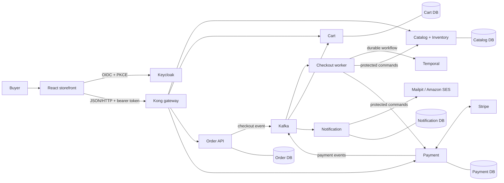

# Northstar project guide

This guide explains the repository as it is implemented: what every runtime component does, how the services are structured, why each major library exists, how data and messages move, and how the local and AWS environments fit together.

Northstar is an educational, production-shaped, buyer-only e-commerce system. It supports a seeded catalog, authenticated carts, a Brazilian shipping-address checkout, manual-capture card payment, order history, and success/failure email. Tax, freight calculation, coupons, fulfillment, returns, administration, guest checkout, and multiple currencies are deliberately outside the current scope.

## Recommended reading order

1. [Architecture](01-architecture.md) — system boundaries, runtime topology, communication styles, and repository layout.
2. [Services](02-services.md) — the catalog/inventory, cart, order, checkout worker, payment, and notification implementations.
3. [Web application](03-web-application.md) — React composition, authentication, data fetching, pages, forms, and Stripe Elements.
4. [Shared packages and libraries](04-packages-and-libraries.md) — every workspace package and direct dependency family, including tooling.
5. [Data, events, and checkout workflow](05-data-events-and-workflows.md) — schemas, ownership, outbox/inbox, Kafka topology, Temporal Saga, idempotency, and compensation.
6. [Security, observability, and reliability](06-security-observability-and-reliability.md) — identity, authorization, gateway controls, telemetry, retries, DLQs, and health checks.
7. [Infrastructure and deployment](07-infrastructure-and-deployment.md) — Docker Compose, Docker images, local platform services, Terraform, AWS, and deployment flow.
8. [Development, testing, and reference](08-development-testing-and-reference.md) — commands, generation, CI, test layers, ports, routes, environment variables, and current limitations.

## One-minute mental model

The key architectural idea is hybrid communication:

- HTTP is used when the caller needs an immediate result, such as reading a cart snapshot or reserving inventory.
- Kafka carries facts that have already happened, such as `payment.authorized.v1` or `order.confirmed.v1`.
- Temporal durably coordinates the multi-step checkout and its compensating actions.
- Each service owns a physically separate PostgreSQL database. There are no cross-database joins or shared Prisma clients.

## Documentation conventions

- A **public route** is reachable through Kong. Authentication can still be required.
- An **internal route** is called only between services and is not routed by Kong.
- A **command** asks a component to do something and can fail immediately.
- An **event** records a fact and is delivered at least once.
- Money is stored and transported as an integer number of Brazilian centavos with currency `BRL`.
- UUIDv7 is used for most business and event identifiers so IDs are unique and roughly time ordered.

## Source of truth

This guide was derived from the application source, Prisma schemas and migrations, package manifests, Compose files, gateway and identity configuration, observability configuration, Terraform, workflows, and tests. Generated Prisma code is an implementation artifact and is not described file by file. Generated OpenAPI and AsyncAPI files remain the machine-readable contract sources under [`docs/api`](../api/).

For design history and operational procedures, also see the existing [ADRs](../adrs/), [runbooks](../runbooks/), [threat model](../security/threat-model.md), [testing strategy](../testing.md), and [implementation status](../implementation-status.md).
